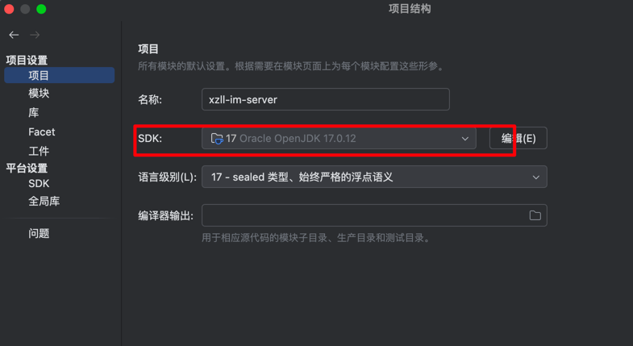
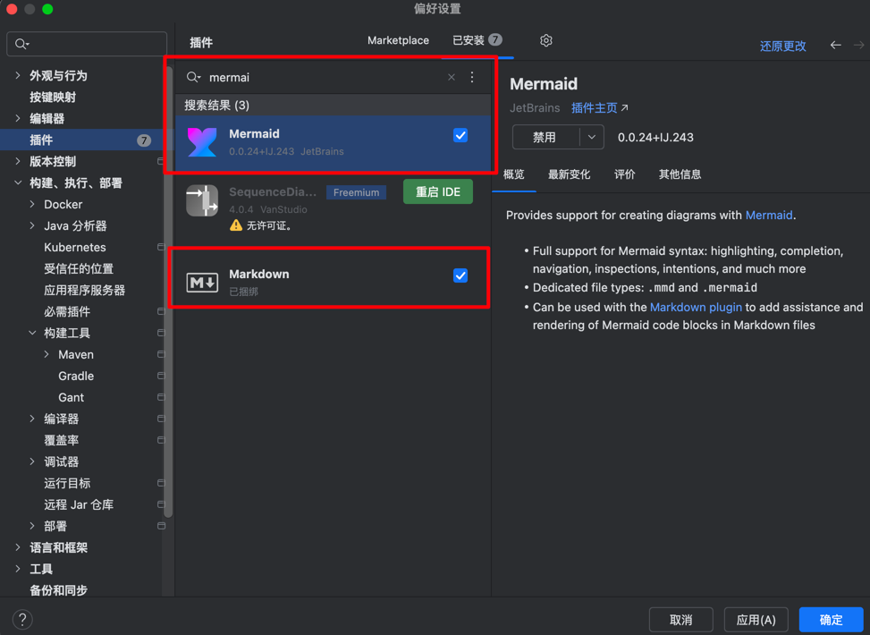

# 🤝 参与贡献指南

欢迎参与 **xzll-im** 分布式IM系统的开源开发！我们非常欢迎各种形式的贡献，无论是代码、文档、测试还是建议。

## 📋 目录

- [🚀 快速开始](#-快速开始)
- [💻 开发环境搭建](#-开发环境搭建)
  - [详细启动指南](#%E8%AF%A6%E7%BB%86%E5%90%AF%E5%8A%A8%E6%8C%87%E5%8D%97)
- [📝 贡献方式](#-贡献方式)
- [🔧 开发流程](#-开发流程)
- [📖 代码规范](#-代码规范)
- [🧪 测试规范](#-测试规范)
- [📚 文档编写](#-文档编写)
- [🐛 问题反馈](#-问题反馈)
- [💬 交流方式](#-交流方式)
- [📋 功能开发进度表](#%E5%8A%9F%E8%83%BD%E5%BC%80%E5%8F%91%E8%BF%9B%E5%BA%A6%E8%A1%A8)

---

## 🚀 快速开始

### 1. 🍴 Fork 项目

```bash
# 服务端
git clone https://github.com/YOUR_USERNAME/xzll-im-server.git

# 客户端 (可选)
git clone https://github.com/YOUR_USERNAME/xzll-im-flutter-client.git
```

### 2. 🔍 查看可参与的任务

我们使用 **GitHub Issues** 和 **GitHub Projects** 来管理开发任务，让任务跟踪更加透明和高效。

#### 📋 查看可用任务
- 访问 [GitHub Issues](https://github.com/598572/xzll-im-server/issues)
- 使用标签筛选感兴趣的任务：
  - `🔥 高优先级` - 急需完成的功能
  - `🌟 中优先级` - 重要但不紧急的功能  
  - `🚀 高级任务` - 复杂功能，需要经验
  - `👶 新手友好` - 适合新手参与

#### 🏷️ 功能分类标签
- `🔐 登录&注册` - 用户认证相关
- `💬 单聊相关` - 一对一聊天功能
- `🗨️ 群聊相关` - 群组聊天功能
- `👥 好友关系` - 好友管理功能
- `📋 会话相关` - 会话管理功能
- `🔧 其他功能` - 其他辅助功能

### 3. 🎯 认领任务流程

1. **浏览任务** - 在 [GitHub Issues](https://github.com/598572/xzll-im-server/issues) 中查看可用任务
2. **选择任务** - 根据你的技能和兴趣选择任务
3. **认领任务** - 在对应的 Issue 中评论表明认领意向
4. **等待确认** - 等待维护者确认分配
5. **开始开发** - 创建功能分支开始开发

---

## 💻 开发环境搭建

### 🖥️ 服务端环境

#### 必需软件
```bash
# Java开发环境
- JDK 17
- Maven 3.6+
- IntelliJ IDEA 2024.x

# 容器环境
- Docker 26.1.4+
- Docker Compose 3.9+
```

#### 依赖中间件
项目已提供，公网可流畅访问（作者个人的ESXI服务器36C/128GB/4TB），无需本地搭建。

#### 详细启动指南

##### 🖥️ 服务端启动步骤

```bash
# 1. 克隆项目
git clone https://github.com/598572/xzll-im-server.git
cd xzll-im-server

# 2. 导入IDEA项目
# 打开IntelliJ IDEA，选择"Open"，选择项目根目录
# 等待Maven依赖下载完成（首次可能需要5-10分钟）

```


3. 配置JDK



4. 搜索并添加markdown和mermaid插件


##### 🚀 微服务启动（无顺序，可在idea全选中，一键启动）


1.  **im-auth (认证服务)** - 端口:8082
    *   位置: `im-auth/src/main/java/com/xzll/auth/IMAuthServiceApplication.java`
    *   作用: 用户认证、JWT令牌生成

2.  **im-connect (长连接服务)** - 端口:10001
    *   位置: `im-connect/im-connect-service/src/main/java/com/xzll/connect/IMConnectServiceApplication.java`
    *   作用: WebSocket连接管理、实时消息推送

3.  **im-business (业务服务)** - 端口:8083
    *   位置: `im-business/im-business-service/src/main/java/com/xzll/business/IMBusinessServiceApplication.java`
    *   作用: 核心业务逻辑、消息处理

4.  **im-console (控制台服务)** - 端口:8084
    *   位置: `im-console/im-console-service/src/main/java/com/xzll/console/IMConsoleServiceImplApplication.java`
    *   作用: 管理后台接口

5.  **im-data-sync (数据同步服务)** - 端口:8085
    *   位置: `im-data-sync/src/main/java/com/xzll/datasync/IMDataSyncApplication.java`
    *   作用: HBase到Elasticsearch数据同步


##### 🔍 启动验证

服务启动成功后，可以通过以下方式验证：

```bash
# 检查服务健康状态
curl http://localhost:8082/actuator/health  # auth服务
curl http://localhost:8083/actuator/health  # business服务
curl http://localhost:8084/actuator/health  # console服务
curl http://localhost:8085/actuator/health  # data-sync服务

# 检查Nacos服务注册
# 访问: http://nacos-server:8848/nacos (线上环境)
```

##### 📱 客户端启动步骤

```bash
# 1. 克隆Flutter客户端
git clone https://github.com/598572/xzll-im-flutter-client.git
cd xzll-im-flutter-client

# 2. 安装依赖
flutter pub get

# 3. 检查Flutter环境
flutter doctor

# 4. 启动应用（确保设备已连接）
flutter run

# 调试模式启动
flutter run --debug

# 发布模式启动  
flutter run --release
```

##### 🐛 常见问题解决

###### Maven依赖下载失败
```bash
# 清理Maven缓存
mvn clean

# 强制更新依赖
mvn clean install -U

# 跳过测试启动
mvn spring-boot:run -Dmaven.test.skip=true
```


###### Flutter环境问题
```bash
# 清理Flutter缓存
flutter clean
flutter pub get

# 重新构建
flutter build apk --debug
```


### 📱 客户端环境

#### Flutter开发环境
```bash
# 安装Flutter SDK
- Flutter 3.24+
- Dart 3.4.4+
- Android Studio 2024.1.1

# 设备要求
- Android模拟器/真机 (API 21+)
- iOS模拟器/真机 (iOS 12+)
```

#### 启动步骤
```bash
git clone https://github.com/598572/xzll-im-flutter-client.git
cd xzll-im-flutter-client
flutter pub get
flutter run
```

---

## 📝 贡献方式

### 🎨 代码贡献
- **新功能开发**: 实现待开发功能
- **Bug修复**: 修复已知问题
- **性能优化**: 提升系统性能
- **代码重构**: 改善代码质量

### 📚 文档贡献
- **技术文档**: API文档、设计文档
- **教程编写**: 使用指南、部署教程
- **代码注释**: 完善代码注释
- **翻译工作**: 多语言文档

### 🧪 测试贡献
- **单元测试**: 编写单元测试用例
- **集成测试**: 模块集成测试
- **压力测试**: 性能压力测试
- **Bug测试**: 发现和验证问题

### 🎨 UI/UX贡献
- **界面设计**: Flutter客户端UI设计
- **交互优化**: 用户体验改进
- **图标设计**: 应用图标和按钮设计

---

## 🔧 开发流程

### 1. 📋 需求分析


### 2. 🌿 分支管理
```bash
# 创建功能分支
git checkout -b feature/your-feature-name

# 示例分支命名
feature/group-chat          # 群聊功能
feature/friend-system       # 好友系统  
feature/message-search      # 消息搜索
bugfix/connection-issue     # 连接问题修复
docs/api-documentation      # API文档编写
```

### 3. 💻 开发实现
```bash
# 保持代码同步
git fetch 
git merge main

# 提交代码
git add .
git commit -m "feat: 添加群聊消息发送功能"
git push origin feature/group-chat
```

### 4. 🔍 代码审查
- **提交Pull Request**
- **填写详细的PR描述**
- **响应Review意见**
- **通过CI/CD检查**

### 5. 🎉 合并发布
- **维护者审核**
- **合并到主分支**
- **更新CHANGELOG**

---

## 📖 代码规范

### ☕ Java代码规范

#### 命名规范
```java
// 类名: 大驼峰
public class ImMessageHandler {
    
    // 方法名: 小驼峰
    public void sendMessage() {}
    
    // 常量: 全大写下划线
    private static final String MSG_TYPE_TEXT = "text";
    
    // 变量: 小驼峰
    private String userId;
}
```

#### 注释规范
```java
/**
 * 消息发送处理器
 * 
 * @author 蝎子莱莱爱打怪
 * @since 2024-01-01
 */
public class MessageSendHandler {
    
    /**
     * 发送单聊消息
     * 
     * @param message 消息内容
     * @param receiverId 接收者ID
     * @return 发送结果
     */
    public SendResult sendC2CMessage(String message, String receiverId) {
        // 实现逻辑
    }
}
```

### 📱 Flutter代码规范

#### 目录结构
```
lib/
├── main.dart
├── models/          # 数据模型
├── services/        # 网络服务
├── pages/          # 页面组件
├── widgets/        # 通用组件
├── utils/          # 工具类
└── constants/      # 常量定义
```

#### 代码风格
```dart
// 类名: 大驼峰
class ChatMessage {
  // 属性: 小驼峰
  final String messageId;
  final String content;
  
  // 构造函数
  const ChatMessage({
    required this.messageId,
    required this.content,
  });
}

// 方法名: 小驼峰
Future<void> sendMessage(String content) async {
  // 实现逻辑
}
```

### 📝 提交信息规范

```bash
# 格式: type(scope): description

# 功能开发
feat(auth): 添加OAuth2认证功能
feat(chat): 实现群聊消息发送

# 问题修复  
fix(connect): 修复WebSocket连接断开问题
fix(ui): 修复聊天界面滚动卡顿

# 文档更新
docs(api): 更新REST API文档
docs(readme): 完善部署说明

# 代码重构
refactor(service): 重构消息处理逻辑

# 性能优化
perf(query): 优化消息查询性能

# 测试相关
test(unit): 添加用户服务单元测试
```

---

## 🧪 测试规范

### 🔬 单元测试
```java
@Test
public void testSendMessage() {
    // Given
    String message = "Hello World";
    String receiverId = "user123";
    
    // When
    SendResult result = messageService.sendMessage(message, receiverId);
    
    // Then
    assertThat(result.isSuccess()).isTrue();
    assertThat(result.getMessageId()).isNotNull();
}
```

### 🔗 集成测试
```java
@SpringBootTest
@Testcontainers
public class MessageIntegrationTest {
    
    @Container
    static RedisContainer redis = new RedisContainer("redis:6.2.6");
    
    @Test
    public void testMessageFlow() {
        // 完整消息流程测试
    }
}
```

### 📱 Flutter测试
```dart
testWidgets('聊天页面显示测试', (WidgetTester tester) async {
  await tester.pumpWidget(ChatPage());
  
  expect(find.text('聊天'), findsOneWidget);
  expect(find.byType(TextField), findsOneWidget);
});
```

---

## 📚 文档编写

### 📋 技术文档结构
```markdown
# 功能名称

## 概述
功能的简要说明

## 技术设计
### 架构图
### 时序图
### 数据库设计

## 实现细节
### 核心代码
### 关键逻辑

## 测试方案
### 测试用例
### 验证步骤

## 部署说明
### 配置参数
### 注意事项
```

### 📖 API文档规范
```markdown
## 发送消息 API

**接口地址**: POST /api/v1/message/send

**请求参数**:
```json
{
  "receiverId": "user123",
  "content": "Hello World",
  "messageType": "text"
}
```

**响应结果**:
```json
{
  "code": 200,
  "message": "success", 
  "data": {
    "messageId": "msg_123456",
    "timestamp": 1640995200000
  }
}
```
```

---

## 🐛 问题反馈

### 🔍 Bug报告模板

创建Issue时请使用以下模板：

```markdown
## Bug描述
简要描述遇到的问题

## 复现步骤
1. 进入聊天页面
2. 发送消息 
3. 观察现象

## 期望行为
描述期望的正确行为

## 实际行为
描述实际发生的错误行为

## 环境信息
- 操作系统: macOS 14.0
- 浏览器: Chrome 120.0
- 客户端版本: v1.0.0
- 服务端版本: v1.0.0

## 错误日志
```
贴出相关错误日志
```

## 截图
如果可能，请提供截图
```

### 💡 功能建议模板

```markdown
## 功能描述
描述建议的新功能

## 使用场景
说明在什么情况下需要这个功能

## 解决方案
提出可能的实现方案

## 其他信息
其他相关信息
```

---

## 💬 交流方式

### 👨‍💻 项目维护者

**蝎子莱莱爱打怪**
- 📧 邮箱: h163361631@163.com
- 📝 博客: [稀土掘金](https://juejin.cn/user/1239904847403927)
- 🐙 GitHub: [@598572](https://github.com/598572)

### 💬 交流群


**加入步骤**:
1. 扫码添加个人微信
2. 说明来意（参与开源项目）
3. 邀请进入技术交流群

### 📧 联系方式

- **项目讨论**: [GitHub Discussions](https://github.com/598572/xzll-im-server/discussions)
- **问题反馈**: [GitHub Issues](https://github.com/598572/xzll-im-server/issues)
- **代码贡献**: [Pull Requests](https://github.com/598572/xzll-im-server/pulls)

---

## 📋 功能开发进度管理

我们使用 **GitHub Issues** 和 **GitHub Projects** 来管理功能开发进度，让任务跟踪更加透明和高效。

### 🎯 如何参与开发

#### 1. 📋 查看可用任务
- 访问 [GitHub Issues](https://github.com/598572/xzll-im-server/issues)
- 使用标签筛选感兴趣的任务：
  - `🔥 高优先级` - 急需完成的功能
  - `⭐ 中优先级` - 重要但不紧急的功能  
  - `⏳ 低优先级` - 不急但有用的功能
  - `🚀 高级任务` - 复杂功能，需要经验
  - `👶 新手友好` - 适合新手参与

#### 2. 🏷️ 功能分类标签
- `🔐 登录&注册` - 用户认证相关
- `💬 单聊相关` - 一对一聊天功能
- `🗨️ 群聊相关` - 群组聊天功能
- `👥 好友关系` - 好友管理功能
- `📋 会话相关` - 会话管理功能
- `🔧 其他功能` - 其他辅助功能

#### 3. 🎯 认领任务流程
1. 在对应的 Issue 中评论表明认领意向
2. 等待维护者确认分配
3. 创建功能分支开始开发
4. 提交 Pull Request 进行代码审查

### 📊 当前开发状态

#### ✅ 已完成功能
- **用户注册** - 后端✅，前端✅
- **用户登录** - 后端✅，前端✅  
- **单聊文字消息** - 后端✅，前端⏳
- **消息撤回** - 后端✅，前端⬜
- **消息ACK确认** - 后端✅，前端⬜
- **消息ID设计** - 后端✅
- **离线消息推送** - 后端✅，前端⬜
- **服务端心跳检测** - 后端✅
- **消息失败重试** - 后端✅，前端⬜

#### ⏳ 进行中功能
- **最近会话列表** - 后端⏳，前端⏳

#### 🔥 高优先级待开发
- **单聊图片消息** - 后端⬜，前端⬜
- **单聊语音消息** - 后端⬜，前端⬜
- **客户端断线重连** - 前端⬜
- **单聊撤回功能** - 前端⬜
- **单聊ACK确认** - 前端⬜

#### ⭐ 中优先级待开发
- **单聊位置消息** - 后端⬜，前端⬜
- **会话置顶** - 后端⬜，前端⬜
- **会话删除** - 后端⬜，前端⬜
- **消息搜索** - 后端⬜，前端⬜
- **消息顺序性** - 前端⬜
- **消息防重处理** - 前端⬜

#### ⏳ 低优先级待开发
- **界面优化** - 前端⬜
- **文档完善** - 文档⬜
- **性能优化** - 后端⬜，前端⬜

#### 🚀 高级任务待开发
- **群聊系统设计** - 后端⬜，前端⬜
- **群聊文字消息** - 后端⬜，前端⬜
- **群聊图片消息** - 后端⬜，前端⬜
- **群聊语音消息** - 后端⬜，前端⬜
- **群聊音视频** - 后端⬜，前端⬜
- **群聊管理** - 后端⬜，前端⬜
- **好友关系管理** - 后端⬜，前端⬜
- **单聊音视频** - 后端⬜，前端⬜

### 🎯 使用 GitHub Projects 管理

我们使用 GitHub Projects 来可视化任务管理，让开发进度更加透明和高效。

#### 📋 项目看板
- **📋 待办** - 新创建的任务，等待认领
- **⏳ 进行中** - 正在开发的任务  
- **🔍 待审查** - 等待代码审查的PR
- **✅ 已完成** - 已合并的功能

#### 🏷️ 标签系统
- **优先级标签**: `🔥高优先级` `⭐中优先级` `⏳低优先级` `🚀高级任务` `👶新手友好`
- **功能标签**: `🔐登录&注册` `💬单聊` `🗨️群聊` `👥好友` `📋会话` `🔧其他`
- **状态标签**: `help wanted` `good first issue` `enhancement` `bug`

#### 🎯 里程碑规划
- **v1.0.0 - 基础功能** (2024-12-31) - 完成基础的单聊功能
- **v1.1.0 - 多媒体消息** (2025-03-31) - 支持图片、语音等多媒体消息
- **v1.2.0 - 群聊功能** (2025-06-30) - 完整的群聊系统
- **v1.3.0 - 好友系统** (2025-09-30) - 好友关系管理

### 📚 技术文档链接

- [登录&注册设计文档](doc/register&login/注册&登录设计文档.md)
- [单聊设计文档](doc/c2c/单聊设计文档.md)
- [最近会话列表设计文档](doc/other/最近会话列表设计文档.md)
- [消息ID设计文档](doc/other/xzll-im消息id设计.md)
- [离线消息设计文档](doc/other/离线消息设计文档.md)
- [超时断连设计文档](doc/other/（服务端）超时断连.md)

---

## 🎯 认领任务建议

### 👶 新手友好任务
- 📝 **文档完善**: 补充代码注释、API文档
- 🧪 **测试编写**: 添加单元测试用例  
- 🎨 **UI优化**: Flutter界面美化
- 🐛 **简单Bug修复**: 修复已知小问题
- 🔄 **消息防重**: 客户端消息去重逻辑
- 📊 **消息顺序**: 客户端消息排序处理

### 🔥 中优先级任务
- 📱 **Flutter前端**: 完善聊天界面和交互
- 🔍 **消息搜索**: 基于Elasticsearch的全文检索
- 📋 **会话管理**: 置顶、删除、免打扰功能
- 📊 **性能优化**: 查询优化、缓存策略
- 🔄 **断线重连**: 客户端重连机制
- 📁 **图片消息**: 图片上传、显示、缓存

### 🚀 高级任务
- 🗨️ **群聊系统**: 完整群聊功能设计实现
- 👥 **好友系统**: 好友关系管理
- 📹 **音视频通话**: WebRTC集成
- 📈 **监控系统**: 完善Skywalking集成
- 🎵 **语音消息**: 语音录制、播放、压缩

---

## 🏆 贡献者认可

我们将通过以下方式感谢贡献者：

- 🌟 **贡献者列表**: README中展示贡献者信息
- 🏅 **特殊标识**: 为活跃贡献者设置特殊身份
- 📢 **社区宣传**: 在技术社区宣传优秀贡献
- 🎁 **定期活动**: 举办贡献者交流活动

---

## 📄 许可证

本项目采用 [MIT许可证](LICENSE)，贡献代码即表示同意该许可证条款。

---

**🎉 再次感谢您的贡献！让我们一起打造优秀的开源IM系统！**
