# 🤝 参与贡献指南

欢迎参与 **xzll-im** 分布式IM系统的开源开发！我们非常欢迎各种形式的贡献，无论是代码、文档、测试还是建议。

## 📋 目录

- [🎯 项目概述](#-项目概述)
- [🚀 快速开始](#-快速开始)
- [💻 开发环境搭建](#-开发环境搭建)
  - [详细启动指南](#%E8%AF%A6%E7%BB%86%E5%90%AF%E5%8A%A8%E6%8C%87%E5%8D%97)
- [📝 贡献方式](#-贡献方式)
- [🔧 开发流程](#-开发流程)
- [📖 代码规范](#-代码规范)
- [🧪 测试规范](#-测试规范)
- [📚 文档编写](#-文档编写)
- [🐛 问题反馈](#-问题反馈)
- [💬 交流方式](#-交流方式)
- [📋 功能开发进度表](#%E5%8A%9F%E8%83%BD%E5%BC%80%E5%8F%91%E8%BF%9B%E5%BA%A6%E8%A1%A8)

---

## 🎯 项目概述

**xzll-im** 是一个基于现代微服务架构的分布式即时通讯系统：

### 🏗️ 技术架构
- **服务端**: Java 11 + Spring Cloud + Dubbo + Netty + RocketMQ
- **客户端**: Flutter + Dart 跨平台移动应用
- **存储**: MySQL + HBase + Redis + Elasticsearch
- **部署**: Jenkins + Docker Compose + Nginx

### 🎯 项目目标
- ✅ **高并发**: 支持万级并发用户
- ✅ **高可用**: 99.9% 系统可用性
- ✅ **高性能**: 毫秒级消息延迟
- ✅ **可扩展**: 水平扩展支持
- ✅ **可观测**: 完整监控体系

---

## 🚀 快速开始

### 1. 🍴 Fork 项目

```bash
# 服务端
git clone https://github.com/YOUR_USERNAME/xzll-im-server.git

# 客户端 (可选)
git clone https://github.com/YOUR_USERNAME/xzll-im-flutter-client.git
```

### 2. 🔍 查看可参与的任务

查看 [功能开发进度表](README.md#22本项目涉及到的功能点) 了解当前开发状态：

#### 🔥 高优先级任务
- 📱 **客户端开发**: Flutter前端界面和交互
- 🗨️ **群聊功能**: 群组消息、群管理
- 👥 **好友系统**: 好友关系管理
- 🔍 **消息搜索**: 基于Elasticsearch的全文检索
- 📁 **多媒体消息**: 图片、语音、视频消息

#### 🌟 中优先级任务
- 📋 **会话管理**: 置顶、删除、免打扰
- 🔄 **断线重连**: 客户端重连机制
- 📊 **性能优化**: 系统性能调优
- 📖 **文档完善**: 技术文档和API文档

### 3. 🏷️ 认领任务

在对应的 [GitHub Issues](https://github.com/598572/xzll-im-server/issues) 中：
1. 查找感兴趣的功能标签
2. 评论表明认领意向
3. 等待维护者确认分配

---

## 💻 开发环境搭建

### 🖥️ 服务端环境

#### 必需软件
```bash
# Java开发环境
- JDK 11+
- Maven 3.6+
- IntelliJ IDEA 2024.x

# 容器环境
- Docker 26.1.4+
- Docker Compose 3.9+
```

#### 依赖中间件
项目已提供**线上测试环境**，无需本地搭建：
- ✅ Nacos 2.0.3 (配置中心/服务注册)
- ✅ ZooKeeper 3.5.1 (Dubbo注册中心)
- ✅ RocketMQ 5.3.0 (消息队列)
- ✅ MySQL 8.0.23 (关系数据库)
- ✅ Redis 6.2.6 (缓存数据库)
- ✅ HBase 2.6.1 (消息存储)
- ✅ Elasticsearch 7.17.5 (搜索引擎)

#### 详细启动指南

##### 🖥️ 服务端启动步骤

```bash
# 1. 克隆项目
git clone https://github.com/598572/xzll-im-server.git
cd xzll-im-server

# 2. 导入IDEA项目
# 打开IntelliJ IDEA，选择"Open"，选择项目根目录
# 等待Maven依赖下载完成（首次可能需要5-10分钟）

# 3. 配置JDK
# File -> Project Structure -> Project -> Project SDK: 选择JDK 11+
```

##### 🚀 微服务启动顺序

**重要**: 必须按以下顺序启动，确保服务依赖关系正确：

1. **im-auth (认证服务)** - 端口:8082
   - 位置: `im-auth/src/main/java/com/xzll/auth/AuthApplication.java`
   - 作用: 用户认证、JWT令牌生成

2. **im-connect (长连接服务)** - 端口:10001  
   - 位置: `im-connect/im-connect-service/src/main/java/com/xzll/connect/ConnectApplication.java`
   - 作用: WebSocket连接管理、实时消息推送

3. **im-business (业务服务)** - 端口:8083
   - 位置: `im-business/im-business-service/src/main/java/com/xzll/business/BusinessApplication.java`
   - 作用: 核心业务逻辑、消息处理

4. **im-console (控制台服务)** - 端口:8084
   - 位置: `im-console/src/main/java/com/xzll/console/ConsoleApplication.java`
   - 作用: 管理后台接口

5. **im-data-sync (数据同步服务)** - 端口:8085
   - 位置: `im-data-sync/src/main/java/com/xzll/sync/DataSyncApplication.java`
   - 作用: HBase到Elasticsearch数据同步

##### 🔍 启动验证

服务启动成功后，可以通过以下方式验证：

```bash
# 检查服务健康状态
curl http://localhost:8082/actuator/health  # auth服务
curl http://localhost:8083/actuator/health  # business服务
curl http://localhost:8084/actuator/health  # console服务
curl http://localhost:8085/actuator/health  # data-sync服务

# 检查Nacos服务注册
# 访问: http://nacos-server:8848/nacos (线上环境)
```

##### 📱 客户端启动步骤

```bash
# 1. 克隆Flutter客户端
git clone https://github.com/598572/xzll-im-flutter-client.git
cd xzll-im-flutter-client

# 2. 安装依赖
flutter pub get

# 3. 检查Flutter环境
flutter doctor

# 4. 启动应用（确保设备已连接）
flutter run

# 调试模式启动
flutter run --debug

# 发布模式启动  
flutter run --release
```

##### 🐛 常见问题解决

###### Maven依赖下载失败
```bash
# 清理Maven缓存
mvn clean

# 强制更新依赖
mvn clean install -U

# 跳过测试启动
mvn spring-boot:run -Dmaven.test.skip=true
```

###### 端口冲突问题
```bash
# 查看端口占用
lsof -i :8082
lsof -i :8083

# 终止占用进程
kill -9 <PID>
```

###### Flutter环境问题
```bash
# 清理Flutter缓存
flutter clean
flutter pub get

# 重新构建
flutter build apk --debug
```

###### 网络连接问题
- 确保能访问线上Nacos: `ping nacos-server-ip`
- 检查防火墙设置
- 确认VPN连接状态

##### 📊 开发工具推荐配置

###### IntelliJ IDEA插件
- **Lombok**: 自动生成getter/setter
- **MyBatisX**: MyBatis增强工具
- **Rainbow Brackets**: 彩色括号
- **GitToolBox**: Git增强工具
- **Alibaba Java Coding Guidelines**: 阿里代码规范

###### Android Studio配置
- **Flutter Inspector**: Flutter调试工具
- **Dart**: Dart语言支持
- **Flutter Intl**: 国际化支持

##### 🔄 热重载开发

###### 服务端热重载
```xml
<!-- pom.xml中添加 -->
<dependency>
    <groupId>org.springframework.boot</groupId>
    <artifactId>spring-boot-devtools</artifactId>
    <optional>true</optional>
</dependency>
```

###### 客户端热重载
```bash
# Flutter支持原生热重载
# 修改代码后按 'r' 重载
# 重启应用按 'R'
```

### 📱 客户端环境

#### Flutter开发环境
```bash
# 安装Flutter SDK
- Flutter 3.24+
- Dart 3.4.4+
- Android Studio 2024.1.1

# 设备要求
- Android模拟器/真机 (API 21+)
- iOS模拟器/真机 (iOS 12+)
```

#### 启动步骤
```bash
git clone https://github.com/598572/xzll-im-flutter-client.git
cd xzll-im-flutter-client
flutter pub get
flutter run
```

---

## 📝 贡献方式

### 🎨 代码贡献
- **新功能开发**: 实现待开发功能
- **Bug修复**: 修复已知问题
- **性能优化**: 提升系统性能
- **代码重构**: 改善代码质量

### 📚 文档贡献
- **技术文档**: API文档、设计文档
- **教程编写**: 使用指南、部署教程
- **代码注释**: 完善代码注释
- **翻译工作**: 多语言文档

### 🧪 测试贡献
- **单元测试**: 编写单元测试用例
- **集成测试**: 模块集成测试
- **压力测试**: 性能压力测试
- **Bug测试**: 发现和验证问题

### 🎨 UI/UX贡献
- **界面设计**: Flutter客户端UI设计
- **交互优化**: 用户体验改进
- **图标设计**: 应用图标和按钮设计

---

## 🔧 开发流程

### 1. 📋 需求分析

```mermaid
flowchart LR
    A[浏览功能列表] --> B[选择感兴趣任务]
    B --> C[查看技术文档]
    C --> D[理解需求细节]
    D --> E[与维护者沟通]
```


### 2. 🌿 分支管理
```bash
# 创建功能分支
git checkout -b feature/your-feature-name

# 示例分支命名
feature/group-chat          # 群聊功能
feature/friend-system       # 好友系统  
feature/message-search      # 消息搜索
bugfix/connection-issue     # 连接问题修复
docs/api-documentation      # API文档编写
```

### 3. 💻 开发实现
```bash
# 保持代码同步
git fetch upstream
git rebase upstream/main

# 提交代码
git add .
git commit -m "feat: 添加群聊消息发送功能"
git push origin feature/group-chat
```

### 4. 🔍 代码审查
- **提交Pull Request**
- **填写详细的PR描述**
- **响应Review意见**
- **通过CI/CD检查**

### 5. 🎉 合并发布
- **维护者审核**
- **合并到主分支**
- **更新CHANGELOG**

---

## 📖 代码规范

### ☕ Java代码规范

#### 命名规范
```java
// 类名: 大驼峰
public class ImMessageHandler {
    
    // 方法名: 小驼峰
    public void sendMessage() {}
    
    // 常量: 全大写下划线
    private static final String MSG_TYPE_TEXT = "text";
    
    // 变量: 小驼峰
    private String userId;
}
```

#### 注释规范
```java
/**
 * 消息发送处理器
 * 
 * @author 蝎子莱莱爱打怪
 * @since 2024-01-01
 */
public class MessageSendHandler {
    
    /**
     * 发送单聊消息
     * 
     * @param message 消息内容
     * @param receiverId 接收者ID
     * @return 发送结果
     */
    public SendResult sendC2CMessage(String message, String receiverId) {
        // 实现逻辑
    }
}
```

### 📱 Flutter代码规范

#### 目录结构
```
lib/
├── main.dart
├── models/          # 数据模型
├── services/        # 网络服务
├── pages/          # 页面组件
├── widgets/        # 通用组件
├── utils/          # 工具类
└── constants/      # 常量定义
```

#### 代码风格
```dart
// 类名: 大驼峰
class ChatMessage {
  // 属性: 小驼峰
  final String messageId;
  final String content;
  
  // 构造函数
  const ChatMessage({
    required this.messageId,
    required this.content,
  });
}

// 方法名: 小驼峰
Future<void> sendMessage(String content) async {
  // 实现逻辑
}
```

### 📝 提交信息规范

```bash
# 格式: type(scope): description

# 功能开发
feat(auth): 添加OAuth2认证功能
feat(chat): 实现群聊消息发送

# 问题修复  
fix(connect): 修复WebSocket连接断开问题
fix(ui): 修复聊天界面滚动卡顿

# 文档更新
docs(api): 更新REST API文档
docs(readme): 完善部署说明

# 代码重构
refactor(service): 重构消息处理逻辑

# 性能优化
perf(query): 优化消息查询性能

# 测试相关
test(unit): 添加用户服务单元测试
```

---

## 🧪 测试规范

### 🔬 单元测试
```java
@Test
public void testSendMessage() {
    // Given
    String message = "Hello World";
    String receiverId = "user123";
    
    // When
    SendResult result = messageService.sendMessage(message, receiverId);
    
    // Then
    assertThat(result.isSuccess()).isTrue();
    assertThat(result.getMessageId()).isNotNull();
}
```

### 🔗 集成测试
```java
@SpringBootTest
@Testcontainers
public class MessageIntegrationTest {
    
    @Container
    static RedisContainer redis = new RedisContainer("redis:6.2.6");
    
    @Test
    public void testMessageFlow() {
        // 完整消息流程测试
    }
}
```

### 📱 Flutter测试
```dart
testWidgets('聊天页面显示测试', (WidgetTester tester) async {
  await tester.pumpWidget(ChatPage());
  
  expect(find.text('聊天'), findsOneWidget);
  expect(find.byType(TextField), findsOneWidget);
});
```

---

## 📚 文档编写

### 📋 技术文档结构
```markdown
# 功能名称

## 概述
功能的简要说明

## 技术设计
### 架构图
### 时序图
### 数据库设计

## 实现细节
### 核心代码
### 关键逻辑

## 测试方案
### 测试用例
### 验证步骤

## 部署说明
### 配置参数
### 注意事项
```

### 📖 API文档规范
```markdown
## 发送消息 API

**接口地址**: POST /api/v1/message/send

**请求参数**:
```json
{
  "receiverId": "user123",
  "content": "Hello World",
  "messageType": "text"
}
```

**响应结果**:
```json
{
  "code": 200,
  "message": "success", 
  "data": {
    "messageId": "msg_123456",
    "timestamp": 1640995200000
  }
}
```
```

---

## 🐛 问题反馈

### 🔍 Bug报告模板

创建Issue时请使用以下模板：

```markdown
## Bug描述
简要描述遇到的问题

## 复现步骤
1. 进入聊天页面
2. 发送消息 
3. 观察现象

## 期望行为
描述期望的正确行为

## 实际行为
描述实际发生的错误行为

## 环境信息
- 操作系统: macOS 14.0
- 浏览器: Chrome 120.0
- 客户端版本: v1.0.0
- 服务端版本: v1.0.0

## 错误日志
```
贴出相关错误日志
```

## 截图
如果可能，请提供截图
```

### 💡 功能建议模板

```markdown
## 功能描述
描述建议的新功能

## 使用场景
说明在什么情况下需要这个功能

## 解决方案
提出可能的实现方案

## 其他信息
其他相关信息
```

---

## 💬 交流方式

### 👨‍💻 项目维护者

**蝎子莱莱爱打怪**
- 📧 邮箱: h163361631@163.com
- 📝 博客: [稀土掘金](https://juejin.cn/user/1239904847403927)
- 🐙 GitHub: [@598572](https://github.com/598572)

### 💬 交流群


**加入步骤**:
1. 扫码添加个人微信
2. 说明来意（参与开源项目）
3. 邀请进入技术交流群

### 📧 联系方式

- **项目讨论**: [GitHub Discussions](https://github.com/598572/xzll-im-server/discussions)
- **问题反馈**: [GitHub Issues](https://github.com/598572/xzll-im-server/issues)
- **代码贡献**: [Pull Requests](https://github.com/598572/xzll-im-server/pulls)

---

## 📋 功能开发进度表

如果你对下边的未实现功能有兴趣或对已实现功能有建议，欢迎提Issues和PR，参与进来一起维护开源，共同成长。

**图例说明**:
> - ⬜ ：未实现
> - ⏳ ：正在进行中  
> - ✅ ：已实现
> - ❌ ：已取消

### 🔐 登录&注册

| 功能 | 当前进度 | 技术文档 | 实现者 | 备注 |
| ---  | --- | --- | --- | --- |
| 注册 | 后端✅，前端✅ | [登录&注册设计文档](doc/register&login/注册&登录设计文档.md) | 蝎子莱莱爱打怪 | 用户注册功能完整实现 |
| 登录 | 后端✅，前端✅ | [登录&注册设计文档](doc/register&login/注册&登录设计文档.md) | 蝎子莱莱爱打怪 | 登录成功后按算法选取可用长连接服务 |

### 💬 单聊相关

| 功能  | 当前进度 | 技术文档 | 实现者 | 备注 |
| ---  | --- | --- | --- | --- |
| 单聊（发文字） | 后端✅，前端⏳ | [单聊设计文档](doc/c2c/单聊设计文档.md) | 后端（蝎子莱莱爱打怪），前端（蝎子莱莱爱打怪） | **🔥 高优先级** |
| 单聊（发图片） | 后端⬜，前端⬜ | [单聊设计文档](doc/c2c/单聊设计文档.md) | - | **🔥 高优先级** |
| 单聊（发位置） | 后端⬜，前端⬜ | [单聊设计文档](doc/c2c/单聊设计文档.md) | - | **🌟 中优先级** |
| 单聊（发语音） | 后端⬜，前端⬜ | [单聊设计文档](doc/c2c/单聊设计文档.md) | - | **🔥 高优先级** |
| 单聊（音/视频）| 后端⬜，前端⬜ | [单聊设计文档](doc/c2c/单聊设计文档.md) | - | **🚀 高级任务** |
| 单聊（撤回）| 后端✅，前端⬜ | [单聊设计文档](doc/c2c/单聊设计文档.md) | 后端（蝎子莱莱爱打怪） | **🔥 高优先级** |
| 单聊（ACK确认）| 后端✅，前端⬜ | [单聊设计文档](doc/c2c/单聊设计文档.md) | 后端（蝎子莱莱爱打怪） | **🔥 高优先级** |

### 🗨️ 群聊相关

| 功能 | 当前进度 | 技术文档 | 实现者 | 备注 |
| --- | --- | --- | --- | --- |
| 群聊（方案/表设计） | ⬜ | - | - | **🚀 高级任务** - 采用写扩散模型 |
| 群聊（发文字） | 后端⬜，前端⬜ | - | - | **🚀 高级任务** |
| 群聊（发图片） | 后端⬜，前端⬜ | - | - | **🚀 高级任务** |
| 群聊（发位置） | 后端⬜，前端⬜ | - | - | **🚀 高级任务** |
| 群聊（发语音） | 后端⬜，前端⬜ | - | - | **🚀 高级任务** |
| 群聊（音/视频） | 后端⬜，前端⬜ | - | - | **🚀 高级任务** |
| 群聊（群管理） | 后端⬜，前端⬜ | - | - | **🚀 高级任务** - 创建/退出/解散/角色管理 |

### 👥 好友关系

| 功能 | 当前进度 | 技术文档 | 实现者 | 备注 |
| --- | --- | --- | --- | --- |
| 好友关系管理 | 后端⬜，前端⬜ | - | - | **🚀 高级任务** |

### 📋 会话相关

| 功能 | 当前进度 | 技术文档 | 实现者 | 备注 |
| --- | --- | --- | --- | --- |
| 置顶 | 后端⬜，前端⬜ | - | - | **🌟 中优先级** |
| 不显示该聊天 | 后端⬜，前端⬜ | - | - | **🌟 中优先级** |
| 删除会话 | 后端⬜，前端⬜ | - | - | **🌟 中优先级** |
| 最近会话列表 | 后端⏳，前端⏳ | [最近会话列表设计文档](doc/other/最近会话列表设计文档.md) | 蝎子莱莱爱打怪 | **🔥 高优先级** |

### 🔧 其他功能

| 功能 | 当前进度 | 技术文档 | 实现者 | 备注 |
| --- | --- | --- | --- | --- |
| 消息id设计 | 后端✅ | [xzll-im消息id设计文档](doc/other/xzll-im消息id设计.md) | 蝎子莱莱爱打怪 | 前端无需参与 |
| 离线消息 | 后端✅，前端⬜ | [离线消息实现概要](doc/other/离线消息设计文档.md) | 后端（蝎子莱莱爱打怪） | Push✅+Pull⬜ |
| 服务端心跳检测 | 后端✅ | [超时断连设计文档](doc/other/（服务端）超时断连.md) | 蝎子莱莱爱打怪 | 前端无需参与 |
| 客户端断线重连 | 前端⬜ | - | - | **🔥 高优先级** - 后端无需参与 |
| 聊天消息搜索 | 后端⬜，前端⬜ | - | - | **🌟 中优先级** - 基于ES |
| 消息失败重试 | 后端✅，前端⬜ | - | 蝎子莱莱爱打怪 | **🔥 高优先级** |
| 消息顺序性 | 前端⬜ | - | - | **🌟 中优先级** - 客户端实现 |
| 消息防重处理 | 前端⬜ | - | - | **🌟 中优先级** - 客户端实现 |
| 直播功能 | 后端⬜，前端⬜ | - | - | **💡 规划中** |

---

## 🎯 认领任务建议

### 👶 新手友好任务
- 📝 **文档完善**: 补充代码注释、API文档
- 🧪 **测试编写**: 添加单元测试用例  
- 🎨 **UI优化**: Flutter界面美化
- 🐛 **简单Bug修复**: 修复已知小问题
- 🔄 **消息防重**: 客户端消息去重逻辑
- 📊 **消息顺序**: 客户端消息排序处理

### 🔥 中优先级任务
- 📱 **Flutter前端**: 完善聊天界面和交互
- 🔍 **消息搜索**: 基于Elasticsearch的全文检索
- 📋 **会话管理**: 置顶、删除、免打扰功能
- 📊 **性能优化**: 查询优化、缓存策略
- 🔄 **断线重连**: 客户端重连机制
- 📁 **图片消息**: 图片上传、显示、缓存

### 🚀 高级任务
- 🗨️ **群聊系统**: 完整群聊功能设计实现
- 👥 **好友系统**: 好友关系管理
- 📹 **音视频通话**: WebRTC集成
- 📈 **监控系统**: 完善Skywalking集成
- 🎵 **语音消息**: 语音录制、播放、压缩

---

## 🏆 贡献者认可

我们将通过以下方式感谢贡献者：

- 🌟 **贡献者列表**: README中展示贡献者信息
- 🏅 **特殊标识**: 为活跃贡献者设置特殊身份
- 📢 **社区宣传**: 在技术社区宣传优秀贡献
- 🎁 **定期活动**: 举办贡献者交流活动

---

## 📄 许可证

本项目采用 [MIT许可证](LICENSE)，贡献代码即表示同意该许可证条款。

---

**🎉 再次感谢您的贡献！让我们一起打造优秀的开源IM系统！**
