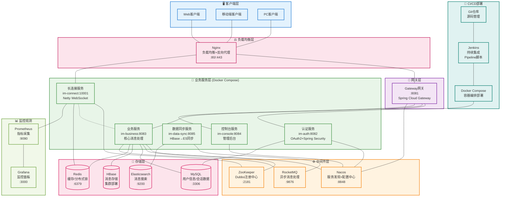

# 前言
## 蝎子莱莱爱打怪 的 IM开源项目 (服务端)

**20241024更新：最近换工作实在太忙，此项目先搁置，不过绝不代表停止！**

与im结缘是在2022年，因为此类系统有足够大的挑战性，所以我对此如痴如醉，之前做过架构以及细节方面的设计，但是一直没有落地。不落地的设计不是好设计。所以有了这个项目。
目前项目处于前期阶段，后期一点点完善并将补上架构图和我能想到的所有设计细节！

想要设计一个好的im系统，是很有难度的，本项目将尽可能达到以下几点：
- 高并发
- 高可用
- 高性能
- 稳定可靠
- 灵活好扩展
- 可观测

下边我们了解下总体设计和一些详细情况。以便有兴趣的人员学习/参与进来，当然如何参与下边也会说到。

# 1、总体设计

## 1.1、架构设计

### 🏗️ 系统架构总览

> 📋 **详细架构说明**: [完整架构文档](系统架构图.md)

## 1.2、表设计

目前表结构详见：[表结构](script/sql/ddl/xzll_im_ddl.sql)，当然有的表会分库分表，脚本在这里：[分库分表脚本](script/sql/limit_table/limit_table_script.sql)

# 2、技术与功能点总结

## 2.1、本项目涉及到的 ***【技术】***
- **已集成**
1. SpringBoot【项目搭建】✅
1. Netty【长连接服务器】✅
1. Spring Cloud Alibaba Nacos【配置中心】✅
1. Dubbo【rpc调用，利用长连接做消息转发】✅
2. zookeeper ✅
1. Redis【缓存，分布式锁】✅
1. RocketMQ【解耦、削峰】✅
1. Mybatis Plus【ORM】✅
1. Mysql【会话/用户信息等量级不大的数据存储】✅
1. hbase【消息数据存储】✅
1. im-data-sync会同步聊天数据到ElasticSearch【用于聊天记录模糊搜索】
2. Spring Cloud GateWay 【网关】✅
1. Oauth2 + Spring Security 【认证&鉴权】✅
1. 在雪花算法基础上 生成含有业务信息的 msgId，长连接获取批量消息id ✅
1. prometheus + grafana【服务监控✅】
1. Jenkins 持续集成与持续交付 ✅
2. docker + docker compose ✅ 
3. nginx ✅

- **待集成**

1. 序列化协议：protobuf (目前是json后续要改造成protobuf)
2. Sentinel 【限流】
3. k8s【项目部署】
4. SkyWalking 【链路追踪】
5. Jmeter+python脚本【压测】
6. redis集群部署
7. elasticsearch集群部署
8. canal 数据同步 mysql同步到es

## 2.2、本项目涉及到的 ***【功能点】***

在此，我使用表格来总结，如果你对下边的未实现功能有兴趣 或者 对已实现功能有建议，欢迎提issues和PR，参与进来一起维护开源，共同成长。 **如何参与？** 详见文档：[CONTRIBUTING](CONTRIBUTING.md)

图例：
> - ⬜ ：未实现
> - ⏳ ：正在进行中
> - ✅ ：已实现
> - ❌ ：取消

### 登录&注册

| 功能 | 当前进度 |技术文档 |实现者 | 备注 |
| ---  | --- | --- | --- | --- |
| 注册 | 后端✅，前端✅| [登录&注册设计文档](doc/register&login/注册&登录设计文档.md) | 蝎子莱莱爱打怪  | 用户注册功能完整实现 |
| 登录 | 后端✅，前端✅ | [登录&注册设计文档](doc/register&login/注册&登录设计文档.md)  | 蝎子莱莱爱打怪  |  在登录成功后，按照算法选取出某一个可用长连接服务 |

### 单聊相关
| 功能  | 当前进度 | 技术文档 |实现者 | 备注 |
| ---  | --- | --- | --- | --- |
| 单聊（发文字） | 后端✅，前端⏳  |[单聊设计文档](doc/c2c/单聊设计文档.md) |  后端（蝎子莱莱爱打怪），前端（蝎子莱莱爱打怪） |   |
| 单聊（发图片） | 后端⬜，前端⬜|  [单聊设计文档](doc/c2c/单聊设计文档.md) |   |   |
| 单聊（发位置） | 后端⬜，前端⬜| [单聊设计文档](doc/c2c/单聊设计文档.md) |   |   |
| 单聊（发语音） | 后端⬜，前端⬜|[单聊设计文档](doc/c2c/单聊设计文档.md) |   |   |
| 单聊（音/视频）| 后端⬜，前端⬜| [单聊设计文档](doc/c2c/单聊设计文档.md)|   |   |
| 单聊（撤回）| 后端✅，前端⬜ | [单聊设计文档](doc/c2c/单聊设计文档.md) |  后端（蝎子莱莱爱打怪），前端（） |   |
| 单聊（送达服务端/客户端未读/客户端已读ack）| 后端✅，前端⬜|[单聊设计文档](doc/c2c/单聊设计文档.md)  |  后端（蝎子莱莱爱打怪），前端（） |   |

### 群聊相关

| 功能 | 当前进度 | 技术文档 |实现者 | 备注 |
| --- | --- | --- | --- | --- |
| 群聊（方案/表设计） | ⬜ |  |   |  准备采用写扩散模型，不再像单聊一样基于dubbo做转发，直接rocketMq广播消费 |
| 群聊（发文字） | 后端⬜，前端⬜|  |   |   |
| 群聊（发图片） | 后端⬜，前端⬜|  |   |   |
| 群聊（发位置） | 后端⬜，前端⬜|  |  |   |
| 群聊（发语音） | 后端⬜，前端⬜|  |   |   |
| 群聊（音/视频） | 后端⬜，前端⬜|  |   |   |
| 群聊（群管理） | 后端⬜，前端⬜|  |   |  创建群聊/退出/解散/群成员角色添加/等 |

### 好友关系
| 功能 | 当前进度 | 技术文档 |实现者 | 备注 |
| --- | --- | --- | --- | --- |
| 好友关系 | 后端⬜，前端⬜ |  |   |   |

### 会话相关

| 功能 | 当前进度 | 技术文档 |实现者 | 备注 |
| --- | --- | --- | --- | --- |
| 置顶 | 后端⬜，前端⬜ | |   |   |
| 不显示该聊天 | 后端⬜，前端⬜ | |   |   |
| 删除会话 | 后端⬜，前端⬜ | |   |   |
| 最近会话列表⏳ | 后端⏳，前端⏳ | [最近会话列表设计文档](doc/other/最近会话列表设计文档.md) | 后端（蝎子莱莱爱打怪），前端（蝎子莱莱爱打怪）  |  此逻辑不需要后端参加 |

### 其他

| 功能 | 当前进度 | 技术文档 |实现者 | 备注 |
| --- | --- | --- | --- | --- |
| 消息id设计 | 后端✅ | [xzll-im消息id设计文档](doc/other/xzll-im消息id设计.md) | 蝎子莱莱爱打怪  |  此逻辑不需要前端参加，前端只管通过长连接批量获取msgId就可以了 |
| 离线消息 | 后端✅，前端⬜ | [离线消息实现概要](doc/other/离线消息设计文档.md) |  后端（蝎子莱莱爱打怪），前端（） | （push✅+pull⬜）  |
| 服务端心跳检测（超时自动剔除客户端连接） | 后端✅ | [（服务端）超时断连设计文档.md](doc/other/（服务端）超时断连.md)  |  后端（蝎子莱莱爱打怪） |  此逻辑不需要前端参加 |
| 客户端断线重连 | 前端⬜| |   |  此逻辑不需要后端参加 |
| 聊天消息搜索 | 后端⬜，前端⬜|  |   |  |
| 消息失败重试 | 后端✅，前端⬜ |  |  后端（蝎子莱莱爱打怪） |  |
| 消息顺序性 | 前端⬜ |  |  | 此功能依赖客户端，服务端不作处理 |
| 消息防重处理 | 前端⬜ |  |  | 此功能依赖客户端，服务端不作处理 |
| 直播| 后端⬜，前端⬜ |  |  | 规划中|

# 3、如何参与开发本项目？

详见文档：[CONTRIBUTING](CONTRIBUTING.md)

# 4、如何启动并运行此项目？

## 4.1、在idea中运行此项目
直接下载此项目main分支，一键启动即可（因为相关依赖的中间件都已经部署在服务器上了，公网可流畅连接）：

## 4.2、演示

编写中.....

# 为了方便协作，可加我微信，然后我给拉进此项目相关群聊。

微信 ：

邮箱 ： h163361631@163.com

