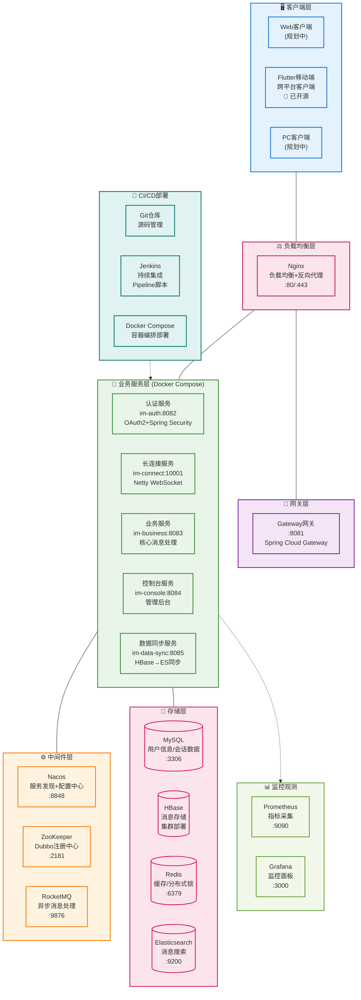
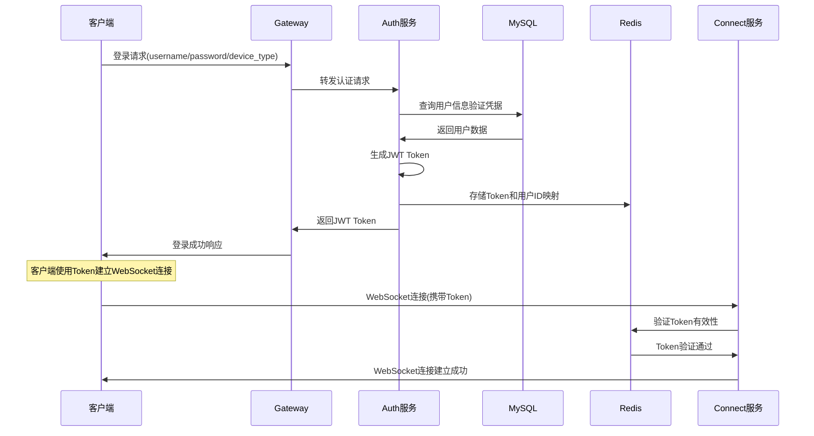
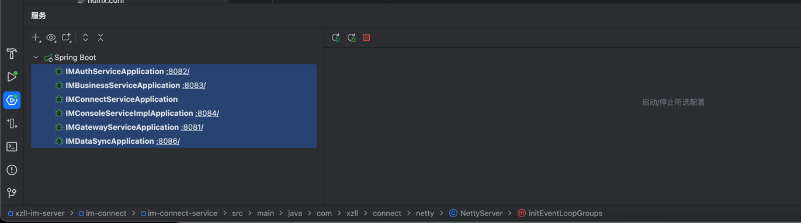

# 前言
## 蝎子莱莱爱打怪 的 IM开源项目 (服务端)

[](https://github.com/598572/xzll-im-server)
[](https://github.com/598572/xzll-im-server)
[](https://github.com/598572/xzll-im-server/blob/main/LICENSE)
[](https://github.com/598572/xzll-im-server/issues)

### 📱 项目仓库
| 端侧 | 技术栈 | GitHub地址 | 描述 |
|------|--------|------------|------|
| **🖥️ 服务端** | Java + Spring Cloud + Dubbo + Netty | [xzll-im-server](https://github.com/598572/xzll-im-server) | 分布式IM后端服务 |
| **📱 客户端** | Flutter + Dart | [xzll-im-flutter-client](https://github.com/598572/xzll-im-flutter-client) | 跨平台移动客户端 |

**20241024更新：最近换工作实在太忙，此项目先搁置，不过绝不代表停止！**

与im结缘是在2022年，因为此类系统有足够大的挑战性，所以我对此如痴如醉，之前做过架构以及细节方面的设计，但是一直没有落地。不落地的设计不是好设计。所以有了这个项目。
目前项目处于前期阶段，后期一点点完善并将补上架构图和我能想到的所有设计细节！

想要设计一个好的im系统，是很有难度的，本项目将尽可能达到以下几点：
- 高并发
- 高可用
- 高性能
- 稳定可靠
- 灵活好扩展
- 可观测


下边我们了解下总体设计和一些详细情况。以便有兴趣的人员学习/参与进来，当然如何参与下边也会说到。

# 1、总体设计

## 1.1、架构设计

### 🏗️ 系统架构总览



---

## 🌐 1.2、物理部署拓扑图

### 🏗️ 集群架构部署

```mermaid
flowchart TD
    %% 客户端
    subgraph CLIENTS ["🖥️ 客户端层"]
        WEB["Web客户端"]
        MOBILE["移动端客户端"] 
        PC["PC客户端"]
    end

    %% 公网服务器
    subgraph PUBLIC_SERVER ["🌐 公网服务器"]
        FRPS["FRP Server<br/>公网IP<br/>内网穿透服务端"]
    end

    %% 内网环境
    subgraph INTERNAL_NETWORK ["🏠 内网环境 (192.168.1.0/24)"]
        %% 负载均衡节点
        subgraph LB_NODE ["⚖️ 192.168.1.101"]
            NGINX["Nginx<br/>负载均衡+反向代理<br/>:80/:443"]
            FRPC1["FRP Client<br/>内网穿透客户端"]
            IM_APP1["IM服务集群<br/>(规划部署)"]
        end

        %% 监控节点
        subgraph MONITOR_NODE ["📊 192.168.1.102"]
            direction TB
            PROMETHEUS["Prometheus<br/>指标采集:9090"]
            GRAFANA["Grafana<br/>监控面板:3000"]
            SKYWALKING["Skywalking<br/>链路追踪:8080"]
            IM_APP2["IM服务集群<br/>(规划部署)"]
        end

        %% 应用服务节点
        subgraph APP_NODE ["🔧 192.168.1.150 (Docker Compose)"]
            direction TB
            GATEWAY["im-gateway:8081"]
            AUTH["im-auth:8082"] 
            BUSINESS["im-business:8083"]
            CONSOLE["im-console:8084"]
            DATASYNC["im-data-sync:8085"]
            CONNECT["im-connect:10001"]
            NACOS["Nacos:8848"]
            JENKINS["Jenkins CI/CD"]
            DOCKER["Docker Engine"]
        end

        %% 集群主节点
        subgraph MASTER_NODE ["🏛️ 192.168.1.130 (集群主节点)"]
            direction TB
            ZK_M["ZooKeeper Master<br/>:2181"]
            RMQ_M["RocketMQ Master<br/>:9876 DLedger"]
            HBASE_M["HBase Master"]
            HDFS_M["HDFS NameNode"]
            HADOOP_M["Hadoop Master"]
            MYSQL_M["MySQL Master<br/>:3306"]
        end

        %% 集群从节点1
        subgraph SLAVE1_NODE ["🔧 192.168.1.131 (集群从节点1)"]
            direction TB
            ZK_S1["ZooKeeper Follower<br/>:2181"]
            RMQ_S1["RocketMQ Follower<br/>:9876 DLedger"]
            HBASE_S1["HBase RegionServer"]
            HDFS_S1["HDFS DataNode"]
            HADOOP_S1["Hadoop Worker"]
            REDIS["Redis<br/>:6379"]
            MYSQL_S["MySQL Slave<br/>:3306"]
        end

        %% 集群从节点2
        subgraph SLAVE2_NODE ["🔧 192.168.1.132 (集群从节点2)"]
            direction TB
            ZK_S2["ZooKeeper Follower<br/>:2181"]
            RMQ_S2["RocketMQ Follower<br/>:9876 DLedger"]
            HBASE_S2["HBase RegionServer"]
            HDFS_S2["HDFS DataNode"]
            HADOOP_S2["Hadoop Worker"]
            ES["Elasticsearch<br/>:9200"]
        end
    end

    %% 外网访问路径
    CLIENTS --> PUBLIC_SERVER
    PUBLIC_SERVER -.-> LB_NODE
    
    %% FRP内网穿透连接(仅101节点)
    FRPS -.-> FRPC1
    
    %% 核心业务流量路径
    LB_NODE --> APP_NODE
    APP_NODE --> MASTER_NODE
    
    %% 数据库主从关系
    MYSQL_M -.-> MYSQL_S

    %% 样式定义
    classDef clientStyle fill:#e3f2fd,stroke:#1976d2,stroke-width:2px
    classDef publicStyle fill:#fff8e1,stroke:#ff8f00,stroke-width:3px
    classDef internalStyle fill:#f1f8e9,stroke:#689f38,stroke-width:2px
    classDef lbStyle fill:#f3e5f5,stroke:#7b1fa2,stroke-width:2px
    classDef monitorStyle fill:#e8eaf6,stroke:#3f51b5,stroke-width:2px
    classDef appStyle fill:#e8f5e8,stroke:#388e3c,stroke-width:2px
    classDef masterStyle fill:#fff3e0,stroke:#f57c00,stroke-width:3px
    classDef slaveStyle fill:#fce4ec,stroke:#c2185b,stroke-width:2px

    class CLIENTS clientStyle
    class PUBLIC_SERVER publicStyle
    class INTERNAL_NETWORK internalStyle
    class LB_NODE lbStyle
    class MONITOR_NODE monitorStyle
    class APP_NODE appStyle
    class MASTER_NODE masterStyle
    class SLAVE1_NODE,SLAVE2_NODE slaveStyle
```



### 📋 节点配置表

| 节点IP | 节点角色 | 部署组件 | 端口 | 用途 |
|---------|---------|----------|------|------|
| **192.168.1.101** | 负载均衡+代理 | Nginx, FRP Client, IM服务(规划) | 80/443 | 流量入口、内网穿透 |
| **192.168.1.102** | 监控节点 | Prometheus, Grafana, Skywalking, IM服务(规划) | 9090/3000/8080 | 系统监控、链路追踪 |
| **192.168.1.150** | 应用服务 | IM微服务群、Nacos、Jenkins、Docker | 8081-8085/10001/8848 | 核心业务逻辑 |
| **192.168.1.130** | 集群主节点 | ZK Master, RMQ Master, HBase Master, HDFS NameNode, MySQL Master | 2181/9876/3306 | 集群协调、数据管理、主数据库 |
| **192.168.1.131** | 集群从节点1 | ZK Follower, RMQ Follower, HBase RegionServer, Redis, MySQL Slave | 2181/9876/6379/3306 | 数据存储、缓存、从数据库 |
| **192.168.1.132** | 集群从节点2 | ZK Follower, RMQ Follower, HBase RegionServer, ES | 2181/9876/9200 | 数据存储、搜索 |

---

## 🔄 1.3、核心业务流程

### 📱 用户登录流程


### 💬 单聊消息发送流程

#### 📊 流程图版本（逻辑流向）

```mermaid
flowchart LR
    A[客户端发送消息] --> B[Connect服务接收]
    B --> C[策略分发C2CMsgSendStrategyImpl]
    
    %% 并行处理分支
    C --> D{并行处理}
    D --> E[发送到RocketMQ<br/>异步业务处理]
    D --> F[查询接收方在线状态<br/>实时消息路由]
    
    %% 异步业务处理分支
    E --> G[Business服务消费MQ]
    G --> H[C2CSendMsgHandler处理]
    H --> I{并行数据存储}
    I --> J[MySQL存储会话信息]
    I --> K[HBase存储消息记录]
    K --> L[触发ES数据同步]
    L --> M[DataSync批量写入ES]
    J --> N[增加未读计数Redis]
    K --> N
    N --> O[Dubbo RPC发送Server ACK]
    O --> P[推送ACK给发送方]
    
    %% 实时消息路由分支
    F --> Q{接收方状态判断}
    Q -->|在线且在本机| R[直接推送WebSocket消息]
    Q -->|在线但在其他机器| S[Dubbo RPC转发到目标机器]
    Q -->|离线| T[发送离线消息事件]
    
    S --> U[目标机器推送消息]
    T --> V[Business处理离线消息]
    V --> W[更新HBase状态为离线]
    W --> X[存储离线消息到Redis]
    X --> Y[伪造未读ACK给发送方]
    
    %% 消息确认流程
    R --> Z[接收方发送ACK]
    U --> Z
    Z --> AA[Connect转发ACK到MQ]
    AA --> BB[Business处理ACK]
    BB --> CC[更新HBase消息状态]
    CC --> DD[触发状态更新ES同步]
    CC --> EE[清零未读计数if已读]
    EE --> FF[Dubbo发送ACK给发送方]
    FF --> GG[推送ACK确认]
    
    %% 样式定义
    classDef connectService fill:#e1f5fe
    classDef businessService fill:#f3e5f5
    classDef mq fill:#fff3e0
    classDef storage fill:#e8f5e8
    classDef client fill:#ffebee
    
    class B,C,F,Q,Z,AA connectService
    class G,H,V,BB businessService
    class E,L,T,AA mq
    class J,K,M,W,CC storage
    class A,R,U,Y,GG client
```


#### ⏰ 时序图版本（详细交互）


---

## 1.4、表设计

目前表结构详见：[表结构](script/sql/ddl/xzll_im_ddl.sql)


# 2、技术栈与功能总结


## 2.1、技术栈总览

### 📊 技术架构图谱

| 技术层次 | 技术选型 | 状态 | 用途说明 |
|----------|----------|------|----------|
| **📱 客户端层** | Flutter + Dart | ✅ | 跨平台移动客户端开发 |
| **🌐 接入层** | Nginx | ✅ | 负载均衡、反向代理、HTTPS终结 |
| **🚪 网关层** | Spring Cloud Gateway | ✅ | 统一API网关、路由分发、限流熔断 |
| **🔧 业务层** | Spring Boot + Spring Cloud | ✅ | 微服务应用框架、服务治理 |
| **🔗 通信层** | Netty + WebSocket + Dubbo | ✅ | 长连接通信、RPC服务调用 |
| **🔐 安全层** | OAuth2 + Spring Security + JWT | ✅ | 身份认证、权限控制、令牌管理 |
| **⚙️ 中间件层** | Nacos + ZooKeeper + RocketMQ | ✅ | 服务注册发现、消息队列、配置管理 |
| **💾 存储层** | MySQL + HBase + Redis + ES | ✅ | 关系数据、大数据、缓存、搜索 |
| **📊 监控层** | Prometheus + Grafana + Skywalking | ✅/⏳ | 性能监控、链路追踪、可视化 |
| **🚀 部署层** | Jenkins + Docker Compose | ✅ | CI/CD流水线、容器编排部署 |

---

### 🔧 详细技术栈

| 分类 | 技术 | 版本         | 状态 | 说明 |
|------|------|------------|------|------|
| **📱 前端** | **Flutter** | 3.24+      | ✅ | 跨平台UI框架，支持Android/iOS |
| **📱 前端** | **Dart** | 3.4.4+     | ✅ | 现代化编程语言，强类型安全 |
| **📱 前端** | **WebSocket Channel** | 2.1.0      | ✅ | WebSocket连接管理 |
| **📱 前端** | **HTTP** | 0.13.3     | ✅ | RESTful API调用 |
| **📱 前端** | **SharedPreferences** | 2.0.15     | ✅ | 本地数据存储 |
| **📱 前端** | **Image Picker** | 0.8.6      | ✅ | 图片选择器 |
| **📱 前端** | **Flutter Sound** | 9.2.13     | ✅ | 音频录制播放 |
| **📱 前端** | **Permission Handler** | 10.2.0     | ✅ | 权限管理 |
| **🖥️ 后端** | **Java** | 11         | ✅ | 核心编程语言 |
| **🖥️ 后端** | **Spring Boot** | 2.7.0      | ✅ | 应用开发框架 |
| **🖥️ 后端** | **Spring Cloud** | 2021.0.3   | ✅ | 微服务治理框架 |
| **🖥️ 后端** | **Spring Cloud Alibaba** | 2021.0.1.0 | ✅ | 阿里云微服务套件 |
| **🖥️ 后端** | **Spring Security** | 5.7.x      | ✅ | 安全认证框架 |
| **🖥️ 后端** | **OAuth2** | 2.2.5      | ✅ | 认证授权协议 |
| **🖥️ 后端** | **Netty** | 4.1.75     | ✅ | 高性能网络通信框架 |
| **🖥️ 后端** | **Dubbo** | 3.0.7      | ✅ | 高性能RPC框架 |
| **🖥️ 后端** | **MyBatis Plus** | 3.5.0      | ✅ | 持久层ORM框架 |
| **🖥️ 后端** | **ShardingSphere** | 5.2.1      | ✅ | 分库分表中间件 |
| **🖥️ 后端** | **Druid** | 1.2.8      | ✅ | 数据库连接池 |
| **🖥️ 后端** | **Hutool** | 5.6.6      | ✅ | Java工具类库 |
| **🖥️ 后端** | **Lombok** | 1.18.20    | ✅ | 代码生成工具 |
| **🖥️ 后端** | **FastJSON** | 1.2.46     | ✅ | JSON解析库 |
| **⚙️ 中间件** | **Nacos** | 2.0.3      | ✅ | 微服务注册中心、配置中心、服务发现 |
| **⚙️ 中间件** | **ZooKeeper** | 3.5.1      | ✅ | 分布式协调服务、Dubbo专用注册中心 |
| **⚙️ 中间件** | **RocketMQ** | 5.3.0      | ✅ | 分布式消息队列、削峰填谷 |
| **⚙️ 中间件** | **Nginx** | 1.24.0     | ✅ | 负载均衡、反向代理 |
| **💾 存储** | **MySQL** | 8.0.23     | ✅ | 关系型数据库、主从复制 |
| **💾 存储** | **HBase** | 2.6.1      | ✅ | 分布式NoSQL、海量消息存储 |
| **💾 存储** | **Redis** | 6.2.6      | ✅ | 内存数据库、缓存、分布式锁 |
| **💾 存储** | **Redisson** | 3.14.0     | ✅ | Redis Java客户端、分布式锁实现 |
| **💾 存储** | **Elasticsearch** | 7.17.5     | ✅ | 搜索引擎、消息全文检索 |
| **💾 存储** | **HDFS** | 3.3.5      | ✅ | 分布式文件系统、HBase底层存储 |
| **💾 存储** | **Hadoop** | 3.3.5      | ✅ | 分布式计算存储框架 |
| **📊 运维** | **Prometheus** | Latest     | ✅ | 系统监控、指标采集 |
| **📊 运维** | **Grafana** | Latest     | ✅ | 监控数据可视化 |
| **📊 运维** | **Skywalking** | 8.x        | ⏳ | APM性能监控、链路追踪 |
| **📊 运维** | **Jenkins** | 2.452      | ✅ | CI/CD持续集成部署、Pipeline脚本 |
| **📊 运维** | **Docker** | 26.1.4     | ✅ | 应用容器化 |
| **📊 运维** | **Docker Compose** | 3.9        | ✅ | 多容器应用编排、一键部署 |
| **🔧 工具** | **Git** | 2.15.0     | ✅ | 版本控制 |
| **🔧 工具** | **Maven** | 3.9.9      | ✅ | 项目构建管理 |
| **🔧 工具** | **IntelliJ IDEA** | 2024.3.3   | ✅ | Java开发IDE |
| **🔧 工具** | **Android Studio** | 2024.1.1   | ✅ | Flutter开发IDE |
| **🔧 工具** | **Postman** | Latest     | ✅ | API接口测试 |


---

### ⏳ **待集成技术**

| 技术 | 优先级 | 说明                |
|------|--------|-------------------|
| **Protocol Buffers** | 高 | 高效序列化协议，替换JSON    |
| **Sentinel** | 高 | 流量控制、熔断降级         |
| **Skywalking** | 中 | 完善APM链路追踪         |
| **JMeter** | 中 | 压力测试工具            |
| **Redis Sentinel** | 中 | Redis哨兵高可用部署     |
| **ES Cluster** | 低 | Elasticsearch集群部署 |
| **K8s** | 低 | 未来大规模容器集群管理       |


## 2.2、本项目涉及到的 ***【功能点】***

在此，我使用表格来总结，如果你对下边的未实现功能有兴趣 或者 对已实现功能有建议，欢迎提issues和PR，参与进来一起维护开源，共同成长。 **如何参与？** 详见文档：[CONTRIBUTING](CONTRIBUTING.md)

图例：
> - ⬜ ：未实现
> - ⏳ ：正在进行中
> - ✅ ：已实现
> - ❌ ：取消

### 登录&注册

| 功能 | 当前进度 |技术文档 |实现者 | 备注 |
| ---  | --- | --- | --- | --- |
| 注册 | 后端✅，前端✅| [登录&注册设计文档](doc/register&login/注册&登录设计文档.md) | 蝎子莱莱爱打怪  | 用户注册功能完整实现 |
| 登录 | 后端✅，前端✅ | [登录&注册设计文档](doc/register&login/注册&登录设计文档.md)  | 蝎子莱莱爱打怪  |  在登录成功后，按照算法选取出某一个可用长连接服务 |


### 单聊相关
| 功能  | 当前进度 | 技术文档 |实现者 | 备注 |
| ---  | --- | --- | --- | --- |
| 单聊（发文字） | 后端✅，前端⏳  |[单聊设计文档](doc/c2c/单聊设计文档.md) |  后端（蝎子莱莱爱打怪），前端（蝎子莱莱爱打怪） |   |
| 单聊（发图片） | 后端⬜，前端⬜|  [单聊设计文档](doc/c2c/单聊设计文档.md) |   |   |
| 单聊（发位置） | 后端⬜，前端⬜| [单聊设计文档](doc/c2c/单聊设计文档.md) |   |   |
| 单聊（发语音） | 后端⬜，前端⬜|[单聊设计文档](doc/c2c/单聊设计文档.md) |   |   |
| 单聊（音/视频）| 后端⬜，前端⬜| [单聊设计文档](doc/c2c/单聊设计文档.md)|   |   |
| 单聊（撤回）| 后端✅，前端⬜ | [单聊设计文档](doc/c2c/单聊设计文档.md) |  后端（蝎子莱莱爱打怪），前端（） |   |
| 单聊（送达服务端/客户端未读/客户端已读ack）| 后端✅，前端⬜|[单聊设计文档](doc/c2c/单聊设计文档.md)  |  后端（蝎子莱莱爱打怪），前端（） |   |

### 群聊相关

| 功能 | 当前进度 | 技术文档 |实现者 | 备注 |
| --- | --- | --- | --- | --- |
| 群聊（方案/表设计） | ⬜ |  |   |  准备采用写扩散模型，不再像单聊一样基于dubbo做转发，直接rocketMq广播消费 |
| 群聊（发文字） | 后端⬜，前端⬜|  |   |   |
| 群聊（发图片） | 后端⬜，前端⬜|  |   |   |
| 群聊（发位置） | 后端⬜，前端⬜|  |  |   |
| 群聊（发语音） | 后端⬜，前端⬜|  |   |   |
| 群聊（音/视频） | 后端⬜，前端⬜|  |   |   |
| 群聊（群管理） | 后端⬜，前端⬜|  |   |  创建群聊/退出/解散/群成员角色添加/等 |


### 好友关系
| 功能 | 当前进度 | 技术文档 |实现者 | 备注 |
| --- | --- | --- | --- | --- |
| 好友关系 | 后端⬜，前端⬜ |  |   |   |

### 会话相关


| 功能 | 当前进度 | 技术文档 |实现者 | 备注 |
| --- | --- | --- | --- | --- |
| 置顶 | 后端⬜，前端⬜ | |   |   |
| 不显示该聊天 | 后端⬜，前端⬜ | |   |   |
| 删除会话 | 后端⬜，前端⬜ | |   |   |
| 最近会话列表⏳ | 后端⏳，前端⏳ | [最近会话列表设计文档](doc/other/最近会话列表设计文档.md) | 后端（蝎子莱莱爱打怪），前端（蝎子莱莱爱打怪）  |  此逻辑不需要后端参加 |

### 其他

| 功能 | 当前进度 | 技术文档 |实现者 | 备注 |
| --- | --- | --- | --- | --- |
| 消息id设计 | 后端✅ | [xzll-im消息id设计文档](doc/other/xzll-im消息id设计.md) | 蝎子莱莱爱打怪  |  此逻辑不需要前端参加，前端只管通过长连接批量获取msgId就可以了 |
| 离线消息 | 后端✅，前端⬜ | [离线消息实现概要](doc/other/离线消息设计文档.md) |  后端（蝎子莱莱爱打怪），前端（） | （push✅+pull⬜）  |
| 服务端心跳检测（超时自动剔除客户端连接） | 后端✅ | [（服务端）超时断连设计文档.md](doc/other/（服务端）超时断连.md)  |  后端（蝎子莱莱爱打怪） |  此逻辑不需要前端参加 |
| 客户端断线重连 | 前端⬜| |   |  此逻辑不需要后端参加 |
| 聊天消息搜索 | 后端⬜，前端⬜|  |   |  |
| 消息失败重试 | 后端✅，前端⬜ |  |  后端（蝎子莱莱爱打怪） |  |
| 消息顺序性 | 前端⬜ |  |  | 此功能依赖客户端，服务端不作处理 |
| 消息防重处理 | 前端⬜ |  |  | 此功能依赖客户端，服务端不作处理 |
| 直播| 后端⬜，前端⬜ |  |  | 规划中|


# 3、如何参与开发本项目？

详见文档：[CONTRIBUTING](CONTRIBUTING.md)

# 4、如何启动并运行此项目？

## 4.1、🖥️ 服务端启动

### IDEA中运行
直接下载此项目main分支，一键启动即可（因为相关依赖的中间件都已经部署在服务器上了，公网可流畅连接）：


## 4.2、📱 客户端启动

### Flutter客户端
1. **前往客户端仓库**: [xzll-im-flutter-client](https://github.com/598572/xzll-im-flutter-client)
2. **环境要求**: 
   - Flutter SDK 
   - Android Studio / VS Code
   - Android/iOS 模拟器或真机
3. **启动步骤**:
   ```bash
   git clone https://github.com/598572/xzll-im-flutter-client.git
   cd xzll-im-flutter-client
   flutter pub get
   flutter run
   ```

## 4.3、📺 演示效果

编写中.....

> 💡 **提示**: 客户端需要与服务端配合使用，请确保服务端已正常启动后再运行客户端。

# 为了方便协作，可加我微信，然后我给拉进此项目相关群聊。

微信 ：


邮箱 ： h163361631@163.com


