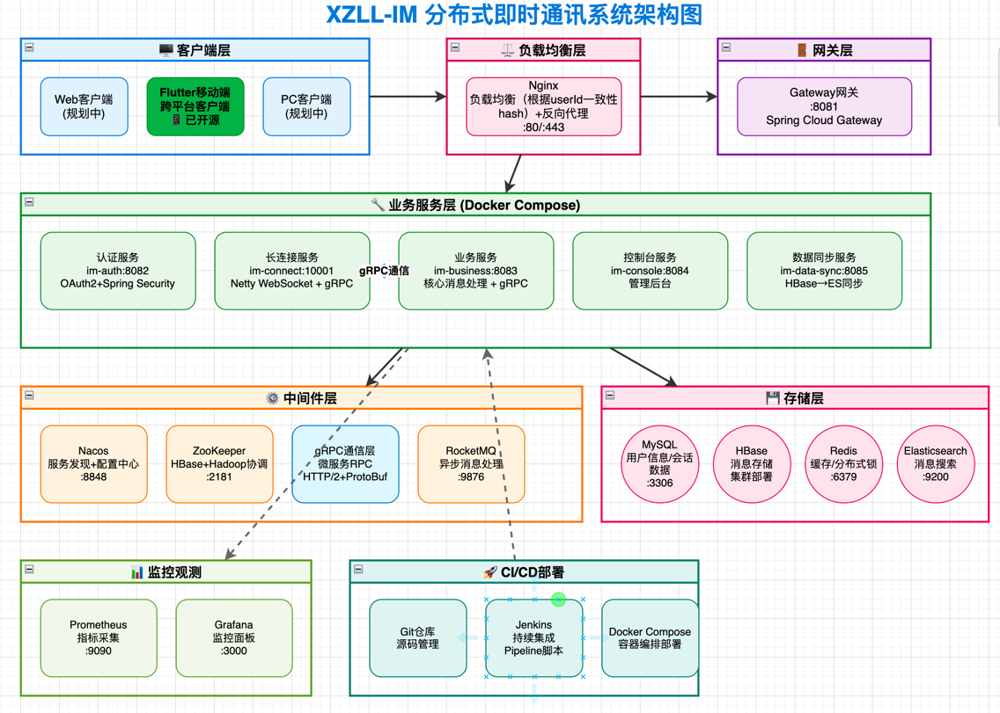
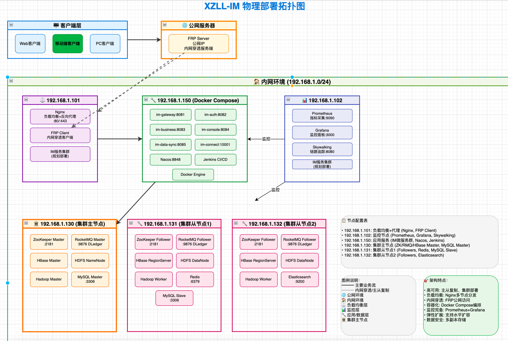
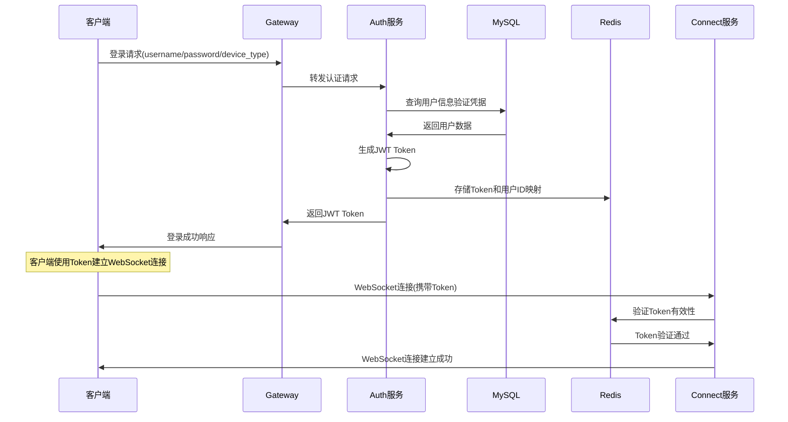
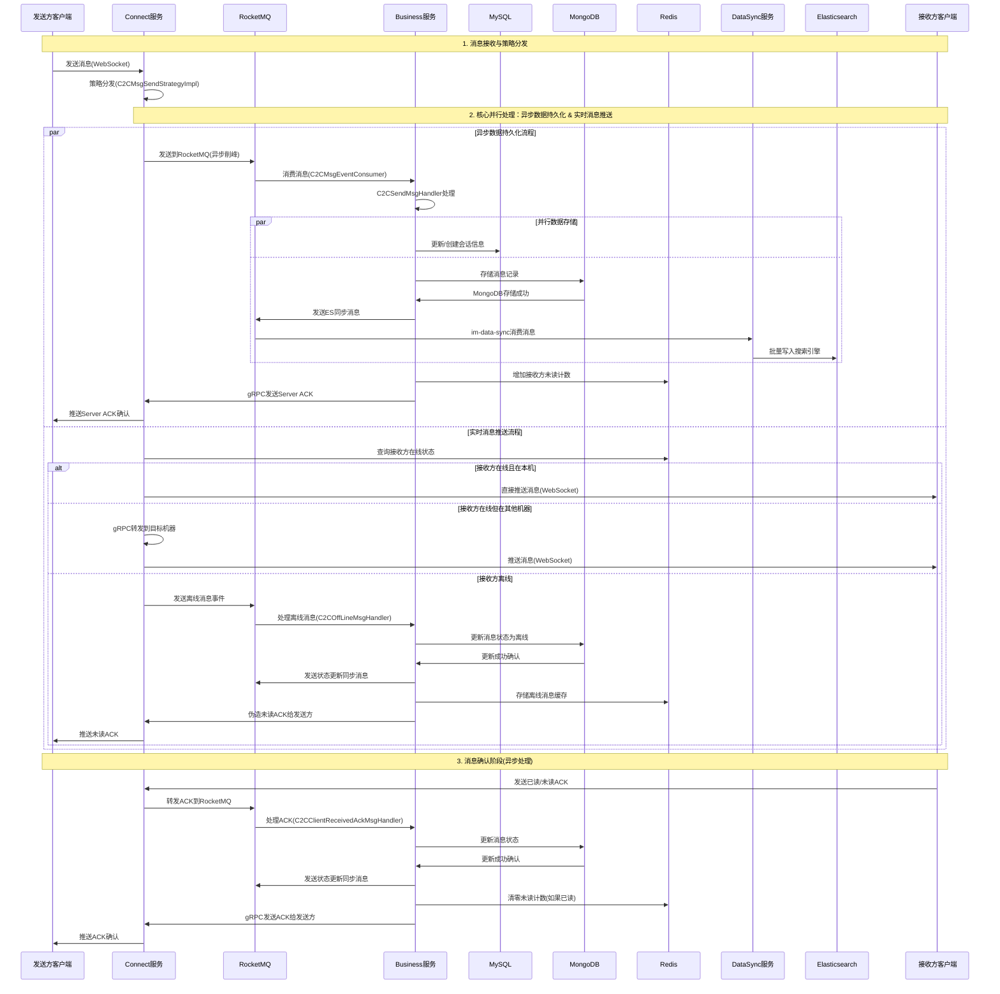
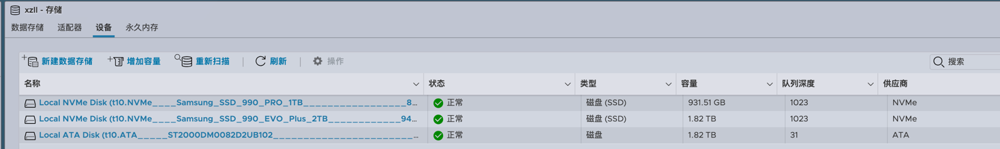
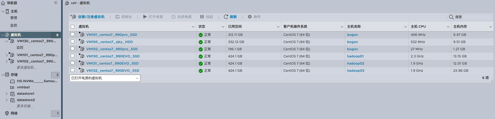

# 前言
## 蝎子莱莱爱打怪 的 IM开源项目 (服务端)

[](https://github.com/598572/xzll-im-server)
[](https://github.com/598572/xzll-im-server)
[](https://github.com/598572/xzll-im-server/blob/main/LICENSE)
[](https://github.com/598572/xzll-im-server/issues)

### 📱 项目仓库
| 端侧 | 技术栈 | GitHub地址 | 描述 |
|------|--------|------------|------|
| **🖥️ 服务端** | Java + Spring Cloud + gRPC + Netty | [xzll-im-server](https://github.com/598572/xzll-im-server) | 分布式IM后端服务 |
| **📱 客户端** | Flutter + Dart | [xzll-im-flutter-client](https://github.com/598572/xzll-im-flutter-client) | 跨平台移动客户端 |
| **🖥️ 后台管理系统** | Vue 3 + TypeScript + Element Plus | [xzll-im-server](https://github.com/598572/xzll-im-server/tree/main/im-console-web) | 完整的后台管理前端 |


与im结缘是在2022年，因为此类系统有足够大的挑战性，所以我对此如痴如醉，之前做过架构以及细节方面的设计，但是一直没有落地。不落地的设计不是好设计。所以有了这个项目。
目前项目处于功能开发阶段。

想要设计一个好的im系统，是很有难度的，本项目将尽可能达到以下几点：
- 高并发
- 高可用
- 高性能
- 稳定可靠
- 灵活好扩展
- 可观测


下边我们了解下总体设计和详细情况。以便有兴趣的人员学习/参与进来，相关群和我个人微信请到此页面最底部。

# 1、总体设计

## 1.1、架构设计

### 🏗️ 系统架构总览




---

## 🌐 1.2、物理部署拓扑图

### 🏗️ 集群架构部署


### 📋 节点配置表

| 节点IP | 节点角色 | 部署组件 | 端口 | 用途 |
|---------|---------|----------|------|------|
| **192.168.1.101** | 负载均衡+代理 | Nginx, FRP Client, IM服务(规划) | 80/443 | 流量入口、内网穿透 |
| **192.168.1.102** | 监控节点 | Prometheus, Grafana, Skywalking, IM服务(规划) | 9090/3000/8080 | 系统监控、链路追踪 |
| **192.168.1.150** | 应用服务 | IM微服务群、Nacos、Jenkins、Docker | 8081-8085/10001/8848 | 核心业务逻辑 |
| **192.168.1.130** | 集群主节点 | RMQ Master, MongoDB Shard1, MySQL Master | 9876/27017/3306 | 消息队列、数据存储、主数据库 |
| **192.168.1.131** | 集群从节点1 | RMQ Follower, MongoDB Shard2, Redis, MySQL Slave | 9876/27017/6379/3306 | 消息队列、数据存储、缓存、从数据库 |
| **192.168.1.132** | 集群从节点2 | RMQ Follower, MongoDB Shard3, ES | 9876/27017/9200 | 消息队列、数据存储、搜索 |

---

## 🔄 1.3、核心业务流程

### 📱 用户登录流程


### 💬 单聊消息发送流程

#### 📊 流程图版本（逻辑流向）

```mermaid
flowchart LR
    A[客户端发送消息] --> B[Connect服务接收]
    B --> C[策略分发C2CMsgSendStrategyImpl]
    
    %% 并行处理分支
    C --> D{并行处理}
    D --> E[发送到RocketMQ<br/>异步业务处理]
    D --> F[查询接收方在线状态<br/>实时消息路由]
    
    %% 异步业务处理分支
    E --> G[Business服务消费MQ]
    G --> H[C2CSendMsgHandler处理]
    H --> I{并行数据存储}
    I --> J[MySQL存储会话信息]
    I --> K[MongoDB存储消息记录]
    K --> L[触发ES数据同步]
    L --> M[DataSync批量写入ES]
    J --> N[增加未读计数Redis]
    K --> N
    N --> O[gRPC发送Server ACK]
    O --> P[推送ACK给发送方]
    
    %% 实时消息路由分支
    F --> Q{接收方状态判断}
    Q -->|在线且在本机| R[直接推送WebSocket消息]
    Q -->|在线但在其他机器| S[gRPC转发到目标机器]
    Q -->|离线| T[发送离线消息事件]
    
    S --> U[目标机器推送消息]
    T --> V[Business处理离线消息]
    V --> W[更新MongoDB状态为离线]
    W --> X[存储离线消息到Redis]
    X --> Y[伪造未读ACK给发送方]
    
    %% 消息确认流程
    R --> Z[接收方发送ACK]
    U --> Z
    Z --> AA[Connect转发ACK到MQ]
    AA --> BB[Business处理ACK]
    BB --> CC[更新MongoDB消息状态]
    CC --> DD[触发状态更新ES同步]
    CC --> EE[清零未读计数if已读]
    EE --> FF[gRPC发送ACK给发送方]
    FF --> GG[推送ACK确认]
    
    %% 样式定义
    classDef connectService fill:#e1f5fe
    classDef businessService fill:#f3e5f5
    classDef mq fill:#fff3e0
    classDef storage fill:#e8f5e8
    classDef client fill:#ffebee
    
    class B,C,F,Q,Z,AA connectService
    class G,H,V,BB businessService
    class E,L,T,AA mq
    class J,K,M,W,CC storage
    class A,R,U,Y,GG client
```


#### ⏰ 时序图版本（详细交互）


---

## 💾 1.4、MongoDB 分片集群架构

### 🏗️ 分片设计

- **集群规模**: 3 节点分片集群
- **分片键**: 会话 ID (conversation_id)
- **版本**: MongoDB 6.0
- **优势**:
  - 按会话分片，同一会话的消息在同一分片，查询效率高
  - 支持水平扩展，轻松应对海量消息存储
  - 自动负载均衡，充分利用集群资源

### 🎯 智能路由机制

**MessageQueryRouter** 实现了查询层面的智能路由，根据查询条件自动选择最优数据源：

| 查询场景 | 路由目标 | 说明 |
|---------|---------|------|
| **按会话 ID 查询** | MongoDB | 精确查询，利用分片键直接定位，性能最优 |
| **全文搜索** | Elasticsearch | 关键词检索，支持模糊匹配、高亮显示 |
| **复杂组合查询** | Elasticsearch | 多条件筛选、范围查询、聚合统计 |

**技术优势**:
- ✅ **高性能**: 精确查询走 MongoDB，避免 ES 过度消耗
- ✅ **低成本**: 减少 ES 集群压力，降低资源使用
- ✅ **可扩展**: 双引擎互补，各展所长

---

## 1.5、表设计

表结构见：[表结构](script/sql)

## 1.6 接口文档（使用Apifox管理接口文档，[戳这里](https://s.apifox.cn/0432ee50-3aa3-47e8-b29f-d7d232108340/355316511e0)）


# 2、技术栈与功能总结


## 2.1、技术栈总览

### 📊 技术架构图谱

| 技术层次 | 技术选型 | 状态 | 用途说明 |
|----------|----------|------|----------|
| **📱 客户端层** | Flutter + Dart | ✅ | 跨平台移动客户端开发 |
| **🌐 接入层** | Nginx | ✅ | 负载均衡、反向代理、HTTPS终结 |
| **🚪 网关层** | Spring Cloud Gateway | ✅ | 统一API网关、路由分发、限流熔断 |
| **🔧 业务层** | Spring Boot + Spring Cloud | ✅ | 微服务应用框架、服务治理 |
| **🔗 通信层** | Netty + WebSocket + gRPC | ✅ | 长连接通信、高性能RPC服务调用 |
| **🔐 安全层** | OAuth2 + Spring Security + JWT | ✅ | 身份认证、权限控制、令牌管理 |
| **⚙️ 中间件层** | Nacos + RocketMQ | ✅ | 服务注册发现、消息队列、配置管理 |
| **💾 存储层** | MySQL + MongoDB + Redis + ES | ✅ | 关系数据、文档存储、缓存、搜索 |
| **📊 监控层** | Prometheus + Grafana + Skywalking | ✅/⏳ | 性能监控、链路追踪、可视化 |
| **🚀 部署层** | Jenkins + Docker Compose | ✅ | CI/CD流水线、容器编排部署 |

---

### 🔧 详细技术栈

| 分类 | 技术 | 版本       | 状态 | 说明 |
|------|------|----------|------|------|
| **📱 前端** | **Flutter** | 3.35+    | ✅ | 跨平台UI框架，支持Android/iOS |
| **📱 前端** | **Dart** | 3.9.0+   | ✅ | 现代化编程语言，强类型安全 |
| **📱 前端** | **WebSocket Channel** | 2.1.0    | ✅ | WebSocket连接管理 |
| **📱 前端** | **HTTP** | 0.13.3   | ✅ | RESTful API调用 |
| **📱 前端** | **SharedPreferences** | 2.0.15   | ✅ | 本地数据存储 |
| **📱 前端** | **Image Picker** | 0.8.6    | ✅ | 图片选择器 |
| **📱 前端** | **Flutter Sound** | 9.2.13   | ✅ | 音频录制播放 |
| **📱 前端** | **Permission Handler** | 10.2.0   | ✅ | 权限管理 |
| **🖥️ 后端** | **Java** | 21       | ✅ | 核心编程语言 |
| **🖥️ 后端** | **Spring Boot** | 3.3.7    | ✅ | 应用开发框架 |
| **🖥️ 后端** | **Spring Cloud** | 2023.0.4 | ✅ | 微服务治理框架 |
| **🖥️ 后端** | **Spring Cloud Alibaba** | 2023.0.1.2 | ✅ | 阿里云微服务套件 |
| **🖥️ 后端** | **Spring Security** | 6.x      | ✅ | 安全认证框架 |
| **🖥️ 后端** | **Spring Authorization Server** | 1.3.3    | ✅ | OAuth2认证授权服务器 |
| **🖥️ 后端** | **Netty** | 4.1.108.Final   | ✅ | 高性能网络通信框架 |
| **🖥️ 后端** | **gRPC** | 1.62.2    | ✅ | 高性能RPC框架，HTTP/2基础 |
| **🖥️ 后端** | **MyBatis Plus** | 3.5.5    | ✅ | 持久层ORM框架 |
| **🖥️ 后端** | **ShardingSphere** | 5.4.1    | ✅ | 分库分表中间件 |
| **🖥️ 后端** | **Druid** | 1.2.21    | ✅ | 数据库连接池 |
| **🖥️ 后端** | **Hutool** | 5.8.25    | ✅ | Java工具类库 |
| **🖥️ 后端** | **Lombok** | 1.18.30  | ✅ | 代码生成工具 |
| **🖥️ 后端** | **FastJSON** | 2.0.47   | ✅ | JSON解析库 |
| **⚙️ 中间件** | **Nacos** | 2.0.3    | ✅ | 微服务注册中心、配置中心、服务发现 |
| **🖥️ 后端** | **Protocol Buffers** | 3.25.3   | ✅ | 高效序列化协议，gRPC消息格式 |
| **⚙️ 中间件** | **RocketMQ** | 5.3.0    | ✅ | 分布式消息队列、削峰填谷 |
| **⚙️ 中间件** | **Nginx** | 1.24.0   | ✅ | 负载均衡、反向代理 |
| **💾 存储** | **MySQL** | 8.3.0   | ✅ | 关系型数据库、主从复制 |
| **💾 存储** | **MongoDB** | 6.0 (3节点分片集群) | ✅ | 文档数据库、按会话ID分片、海量消息存储 |
| **💾 存储** | **Redis** | 6.2.6    | ✅ | 内存数据库、缓存、分布式锁 |
| **💾 存储** | **Redisson** | 3.40.2   | ✅ | Redis Java客户端、分布式锁实现 |
| **💾 存储** | **Elasticsearch** | 7.17.18   | ✅ | 搜索引擎、消息全文检索 |
| **📊 运维** | **Prometheus** | Latest   | ✅ | 系统监控、指标采集 |
| **📊 运维** | **Grafana** | Latest   | ✅ | 监控数据可视化 |
| **📊 运维** | **Skywalking** | 8.x      | ⏳ | APM性能监控、链路追踪 |
| **📊 运维** | **Jenkins** | 2.452    | ✅ | CI/CD持续集成部署、Pipeline脚本 |
| **📊 运维** | **Docker** | 26.1.4   | ✅ | 应用容器化 |
| **📊 运维** | **Docker Compose** | 3.9      | ✅ | 多容器应用编排、一键部署 |
| **🔧 工具** | **Git** | 2.15.0   | ✅ | 版本控制 |
| **🔧 工具** | **Maven** | 3.9.9    | ✅ | 项目构建管理 |
| **🔧 工具** | **IntelliJ IDEA** | 2024.3.3 | ✅ | Java开发IDE |
| **🔧 工具** | **Android Studio** | 2024.1.1 | ✅ | Flutter开发IDE |
| **🔧 工具** | **Postman** | Latest   | ✅ | API接口测试 |


---

### ⏳ **待集成技术**

| 技术 | 优先级 | 说明                |
|------|--------|-------------------|
| **Sentinel** | 高 | 流量控制、熔断降级         |
| **Skywalking** | 中 | 完善APM链路追踪         |
| **JMeter** | 中 | 压力测试工具            |
| **Redis Sentinel** | 中 | Redis哨兵高可用部署     |
| **ES Cluster** | 低 | Elasticsearch集群部署 |
| **K8s** | 低 | 未来大规模容器集群管理       |


---

## 2.2、核心功能概览

### ✅ **已实现功能**
- 🔐 **用户认证**: 注册、登录（OAuth2 + JWT）
- 💬 **单聊消息**: 文字消息发送、撤回、ACK确认
- 📊 **消息存储**: MongoDB 3节点分片集群 + Elasticsearch搜索
- 🎯 **智能路由**: 根据查询条件自动路由 MongoDB（按会话ID精确查询）或 ES（全文检索）
- 🔄 **离线消息**: Push推送机制（Pull拉取开发中）
- ⚡ **实时通信**: WebSocket长连接 + Netty高性能
- 🆔 **消息ID**: 分布式唯一ID生成算法
- 💓 **心跳检测**: 服务端自动剔除超时连接

### 🎯 **后台管理系统** (NEW!)
- 👨‍💼 **管理员认证**: 登录、JWT Token验证、权限控制
- 📊 **数据看板**: 用户统计、消息趋势、终端分布
- 👥 **用户管理**: 用户查询、详情、禁用、踢下线
- 🤝 **好友管理**: 好友关系查询、双向检测
- 🚫 **封禁管理**: 用户/IP/设备封禁、解封
- 🚨 **举报处理**: 举报列表、审核处理
- 📢 **系统公告**: 创建、发布、撤回公告
- 📝 **操作日志**: 管理员操作记录查询
- 🔍 **敏感词管理**: CRUD、批量导入、DFA算法检测
- 💬 **历史消息**: MongoDB/ES智能路由查询、消息检索

### 🤖 **AI智能功能** (NEW!)
- 💬 **AI智能客服**: 对话界面、实时回复
- 📚 **AI知识库**: FAQ管理、分类管理
- ⚙️ **AI配置中心**: 模型配置、API配置、提示词管理
- 📊 **AI对话管理**: 对话历史查询、统计分析

### 🚧 **开发中功能**  
- 📱 **Flutter客户端**: 聊天界面和交互逻辑
- 📋 **会话管理**: 最近会话列表
- 👥 **好友系统**: 好友关系管理


### 📋 **规划功能**
- 🗨️ **群聊系统**: 群组消息、群管理（写扩散模型）
- 📁 **多媒体消息**: 图片、语音、视频消息
- 🔍 **消息搜索**: 基于Elasticsearch的全文检索
- 📱 **客户端增强**: 断线重连、消息排序、防重处理
- 🎯 **会话功能**: 置顶、删除、免打扰
- 📹 **音视频通话**: WebRTC实时通信
- 📺 **直播功能**: 实时直播推流

### 🤝 **参与开发**

> 💡 **想了解详细开发进度？** 查看 [📋 功能开发进度表](CONTRIBUTING.md#%E5%8A%9F%E8%83%BD%E5%BC%80%E5%8F%91%E8%BF%9B%E5%BA%A6%E8%A1%A8)
> 
> 🚀 **想参与贡献？** 阅读 [🤝 参与贡献指南](CONTRIBUTING.md) 了解如何加入我们


# 3、如何参与开发本项目？

详见文档：[CONTRIBUTING](CONTRIBUTING.md)

# 4、如何启动并运行此项目？

## 4.1、🖥️ 服务端启动

### IDEA中运行
直接下载此项目main分支，一键启动即可（因为相关依赖的中间件都已经部署在服务器上了，公网可流畅连接）：


> 💡 **开发者详细指南**: 查看 [详细启动指南](CONTRIBUTING.md#%E8%AF%A6%E7%BB%86%E5%90%AF%E5%8A%A8%E6%8C%87%E5%8D%97) 了解完整的开发环境搭建、微服务启动顺序、常见问题解决等

## 4.2、📱 客户端启动

### Flutter客户端
1. **前往客户端仓库**: [xzll-im-flutter-client](https://github.com/598572/xzll-im-flutter-client)
2. **快速启动**:
   ```bash
   git clone https://github.com/598572/xzll-im-flutter-client.git
   cd xzll-im-flutter-client
   flutter pub get
   flutter run
   ```

> 💡 **Flutter开发详细指南**: 查看 [详细启动指南](CONTRIBUTING.md#%E8%AF%A6%E7%BB%86%E5%90%AF%E5%8A%A8%E6%8C%87%E5%8D%97) 了解Flutter环境配置、调试技巧、常见问题解决等

## 4.3、📺 演示效果

编写中.....

# 硬件&服务器情况了解

磁盘情况：


当前基于esxi虚拟出了6台机器：



# 为了方便协作，可加我微信，然后我给拉进此项目相关群聊。

个人微信 ：


想进群沟通的话，请加我微信。

邮箱 ： h163361631@163.com

**本人稀土掘金博客**： https://juejin.cn/user/1239904847403927/posts
一些中间件部署，各类技术知识点和IM开发过程中遇到的问题，甚至硬件环境搭建都会记录到 **此博客**


