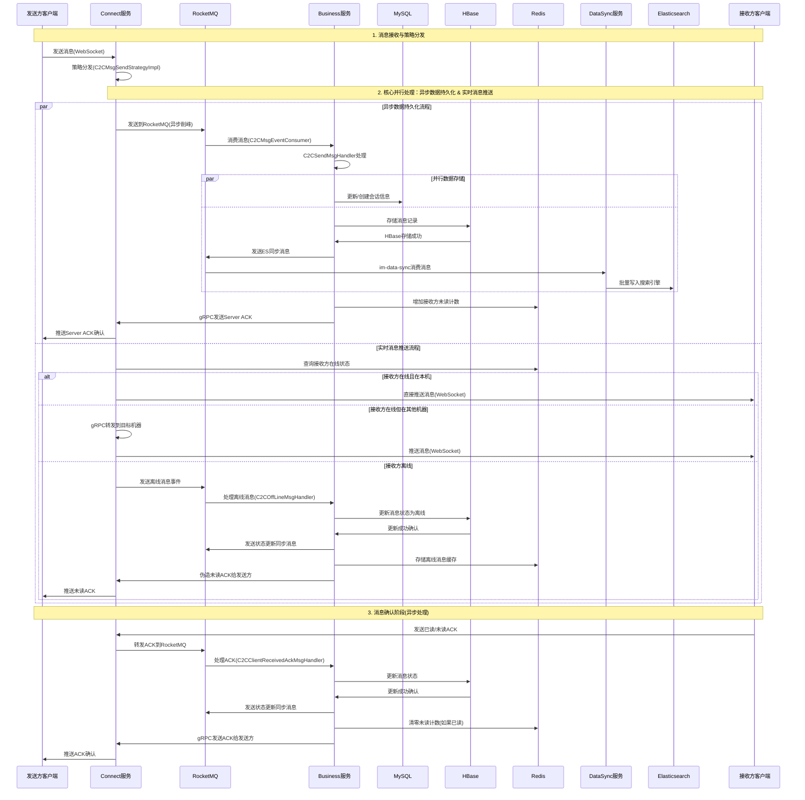

# 单聊设计文档

### 💬 单聊消息发送流程

#### 📊 流程图版本（逻辑流向）

```mermaid
flowchart LR
    A[客户端发送消息] --> B[Connect服务接收]
    B --> C[策略分发C2CMsgSendStrategyImpl]
    
    %% 并行处理分支
    C --> D{并行处理}
    D --> E[发送到RocketMQ<br/>异步业务处理]
    D --> F[查询接收方在线状态<br/>实时消息路由]
    
    %% 异步业务处理分支
    E --> G[Business服务消费MQ]
    G --> H[C2CSendMsgHandler处理]
    H --> I{并行数据存储}
    I --> J[MySQL存储会话信息]
    I --> K[HBase存储消息记录]
    K --> L[触发ES数据同步]
    L --> M[DataSync批量写入ES]
    J --> N[增加未读计数Redis]
    K --> N
    N --> O[gRPC发送Server ACK]
    O --> P[推送ACK给发送方]
    
    %% 实时消息路由分支
    F --> Q{接收方状态判断}
    Q -->|在线且在本机| R[直接推送WebSocket消息]
    Q -->|在线但在其他机器| S[gRPC转发到目标机器]
    Q -->|离线| T[发送离线消息事件]
    
    S --> U[目标机器推送消息]
    T --> V[Business处理离线消息]
    V --> W[更新HBase状态为离线]
    W --> X[存储离线消息到Redis]
    X --> Y[伪造未读ACK给发送方]
    
    %% 消息确认流程
    R --> Z[接收方发送ACK]
    U --> Z
    Z --> AA[Connect转发ACK到MQ]
    AA --> BB[Business处理ACK]
    BB --> CC[更新HBase消息状态]
    CC --> DD[触发状态更新ES同步]
    CC --> EE[清零未读计数if已读]
    EE --> FF[gRPC发送ACK给发送方]
    FF --> GG[推送ACK确认]
    
    %% 样式定义
    classDef connectService fill:#e1f5fe
    classDef businessService fill:#f3e5f5
    classDef mq fill:#fff3e0
    classDef storage fill:#e8f5e8
    classDef client fill:#ffebee
    
    class B,C,F,Q,Z,AA connectService
    class G,H,V,BB businessService
    class E,L,T,AA mq
    class J,K,M,W,CC storage
    class A,R,U,Y,GG client
```

#### ⏰ 时序图版本（详细交互）

```mermaid
sequenceDiagram
    participant C1 as 发送方客户端
    participant CON as Connect服务
    participant MQ as RocketMQ
    participant BIZ as Business服务
    participant M as MySQL
    participant H as HBase
    participant R as Redis
    participant DS as DataSync服务
    participant ES as Elasticsearch
    participant C2 as 接收方客户端

    Note over C1,C2: 1. 消息接收与策略分发
    C1->>CON: 发送消息(WebSocket)
    CON->>CON: 策略分发(C2CMsgSendStrategyImpl)
    
    Note over CON,C2: 2. 核心并行处理：异步数据持久化 & 实时消息推送
    par 异步数据持久化流程
        CON->>MQ: 发送到RocketMQ(异步削峰)
        MQ->>BIZ: 消费消息(C2CMsgEventConsumer)
        BIZ->>BIZ: C2CSendMsgHandler处理
        par 并行数据存储
            BIZ->>M: 更新/创建会话信息
        and 
            BIZ->>H: 存储消息记录
            H->>BIZ: HBase存储成功
            BIZ->>MQ: 发送ES同步消息
            MQ->>DS: im-data-sync消费消息
            DS->>ES: 批量写入搜索引擎
        end
        BIZ->>R: 增加接收方未读计数
        BIZ->>CON: gRPC发送Server ACK
        CON->>C1: 推送Server ACK确认
    and 实时消息推送流程
        CON->>R: 查询接收方在线状态
        alt 接收方在线且在本机
            CON->>C2: 直接推送消息(WebSocket)
        else 接收方在线但在其他机器
            CON->>CON: gRPC转发到目标机器
            CON->>C2: 推送消息(WebSocket)
        else 接收方离线
            CON->>MQ: 发送离线消息事件
            MQ->>BIZ: 处理离线消息(C2COffLineMsgHandler)
            BIZ->>H: 更新消息状态为离线
            H->>BIZ: 更新成功确认
            BIZ->>MQ: 发送状态更新同步消息
            BIZ->>R: 存储离线消息缓存
            BIZ->>CON: 伪造未读ACK给发送方
            CON->>C1: 推送未读ACK
        end
    end
    
    Note over C2,C1: 3. 消息确认阶段(异步处理)
    C2->>CON: 发送已读/未读ACK
    CON->>MQ: 转发ACK到RocketMQ
    MQ->>BIZ: 处理ACK(C2CClientReceivedAckMsgHandler)
    BIZ->>H: 更新消息状态
    H->>BIZ: 更新成功确认
    BIZ->>MQ: 发送状态更新同步消息
    BIZ->>R: 清零未读计数(如果已读)
    BIZ->>CON: gRPC发送ACK给发送方
    CON->>C1: 推送ACK确认
```
