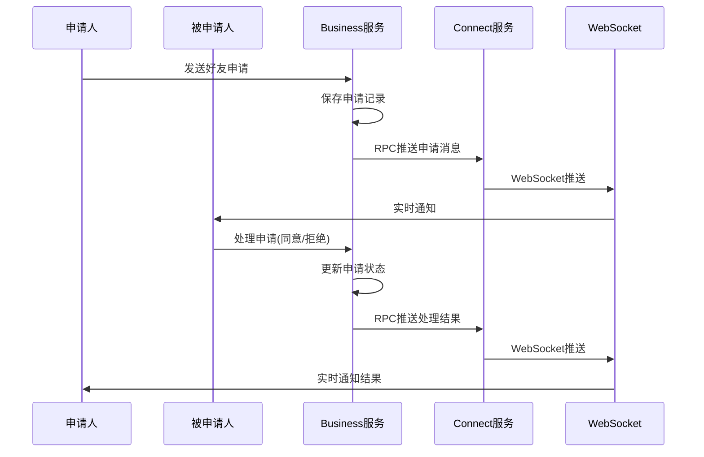

# 🎉 好友申请实时推送功能实现完成！

## 功能概述

已成功为您的好友管理功能实现了实时消息推送，现在用户可以：

- ✅ **实时接收好友申请** - 有人申请添加好友时立即收到推送通知
- ✅ **实时接收处理结果** - 好友申请被同意/拒绝时申请人立即收到推送通知
- ✅ **跨服务器推送** - 支持分布式部署下的消息推送
- ✅ **离线消息推送** - 用户离线时消息会缓存，上线后推送

## 📋 实现架构

### 推送流程



### 核心组件

1. **推送消息对象**
   - `FriendRequestPushVO` - 推送消息响应对象
   - `FriendRequestPushAO` - 推送消息请求对象

2. **推送服务**
   - `FriendRequestPushService` - 推送服务接口
   - `FriendRequestPushServiceImpl` - 推送服务实现

3. **RPC接口**
   - `RpcSendMsg2ClientApi.sendFriendRequestPush2Client()` - 推送接口

4. **消息常量**
   - `FRIEND_REQUEST_PUSH = 60` - 好友申请推送
   - `FRIEND_REQUEST_HANDLE_PUSH = 70` - 好友申请处理结果推送

## 🚀 推送消息格式

### 新的好友申请推送 (pushType = 1)

```json
{
  "url": "xzll/im/friend/request/push",
  "body": {
    "pushType": 1,
    "requestId": "req_12345",
    "fromUserId": "user001",
    "fromUserName": "张三",
    "fromUserAvatar": "https://avatar.jpg",
    "toUserId": "user002",
    "requestMessage": "你好，我想加你为好友",
    "status": 0,
    "statusText": "待处理",
    "pushTitle": "好友申请",
    "pushContent": "张三 请求添加您为好友",
    "createTime": "2024-09-17T20:00:00",
    "msgId": "msg_123",
    "msgCreateTime": 1694962800000
  }
}
```

### 好友申请处理结果推送 (pushType = 2)

```json
{
  "url": "xzll/im/friend/request/handle/push",
  "body": {
    "pushType": 2,
    "requestId": "req_12345",
    "fromUserId": "user001",
    "toUserId": "user002",
    "status": 1,
    "statusText": "已同意",
    "pushTitle": "好友申请结果",
    "pushContent": "李四 同意了您的好友申请",
    "handleTime": "2024-09-17T20:05:00",
    "msgId": "msg_124",
    "msgCreateTime": 1694963100000
  }
}
```

## 📱 客户端集成

### WebSocket消息监听

客户端需要监听以下URL的消息：

```javascript
// 监听好友申请推送
if (message.url === 'xzll/im/friend/request/push') {
    const friendRequest = message.body;
    if (friendRequest.pushType === 1) {
        // 显示新的好友申请通知
        showFriendRequestNotification(friendRequest);
        // 更新好友申请列表
        updateFriendRequestList();
    }
}

// 监听好友申请处理结果推送
if (message.url === 'xzll/im/friend/request/handle/push') {
    const result = message.body;
    if (result.pushType === 2) {
        // 显示处理结果通知
        showHandleResultNotification(result);
        if (result.status === 1) {
            // 如果同意，更新好友列表
            updateFriendList();
        }
    }
}
```

### 推送消息处理建议

```javascript
function showFriendRequestNotification(request) {
    // 显示系统通知
    if (Notification.permission === 'granted') {
        new Notification(request.pushTitle, {
            body: request.pushContent,
            icon: request.fromUserAvatar
        });
    }
    
    // 更新UI红点提示
    updateFriendRequestBadge();
    
    // 播放提示音
    playNotificationSound();
}

function showHandleResultNotification(result) {
    // 显示结果通知
    showToast(result.pushContent);
    
    // 如果是同意，可能需要更新相关UI
    if (result.status === 1) {
        // 更新好友列表
        refreshFriendList();
        // 可以发起聊天了
        enableChatWithNewFriend(result.toUserId);
    }
}
```

## 🔧 服务端配置

### 1. 启动顺序

确保按以下顺序启动服务：

1. **基础服务** - MySQL、Redis、RocketMQ、Nacos
2. **im-connect-service** - 连接服务（处理WebSocket推送）
3. **im-business-service** - 业务服务（处理好友申请逻辑）

### 2. 配置检查

确保以下配置正确：

- **Dubbo配置** - Business服务能够调用Connect服务的RPC接口
- **WebSocket配置** - Connect服务的WebSocket正常工作
- **用户在线状态** - Redis中正确维护用户登录状态

## 📊 监控和日志

### 关键日志

**Business服务日志：**
```
INFO - 推送好友申请消息，申请ID:req_12345, 申请人:user001, 被申请人:user002
INFO - 推送好友申请处理结果成功，申请ID:req_12345
```

**Connect服务日志：**
```
INFO - 发送好友申请推送消息到客户端，用户ID:user002
INFO - WebSocket推送成功，频道:channel_user002
```

### 错误处理

- 推送失败不会影响主业务流程
- 离线用户的推送消息会缓存到Redis
- 跨服务器推送自动路由到用户所在服务器

## 🎯 测试步骤

### 1. 基本推送测试

1. 用户A和用户B都登录系统
2. 用户A向用户B发送好友申请
3. 验证用户B立即收到推送通知
4. 用户B处理申请（同意/拒绝）
5. 验证用户A立即收到处理结果推送

### 2. 离线推送测试

1. 用户B处于离线状态
2. 用户A向用户B发送好友申请
3. 用户B重新登录
4. 验证用户B收到离线期间的好友申请推送

### 3. 跨服务器推送测试

1. 部署多个Connect服务实例
2. 用户A连接到服务器1，用户B连接到服务器2
3. 测试好友申请推送是否正常工作

## 🚨 注意事项

1. **消息去重** - 客户端应该根据msgId进行消息去重
2. **推送时机** - 推送在数据库事务提交后进行，确保数据一致性
3. **异常处理** - 推送失败不会回滚主业务，保证系统稳定性
4. **性能考虑** - 推送使用异步处理，不影响接口响应时间

## 🎉 功能完成

现在您的IM系统具备了完整的好友管理和实时推送功能：

1. **好友申请** → **实时推送** → **处理申请** → **结果推送** → **开始聊天**

用户体验大大提升，可以实时感知好友申请状态变化！

---

**恭喜！好友申请实时推送功能已完全实现并可以使用！** 🎊
