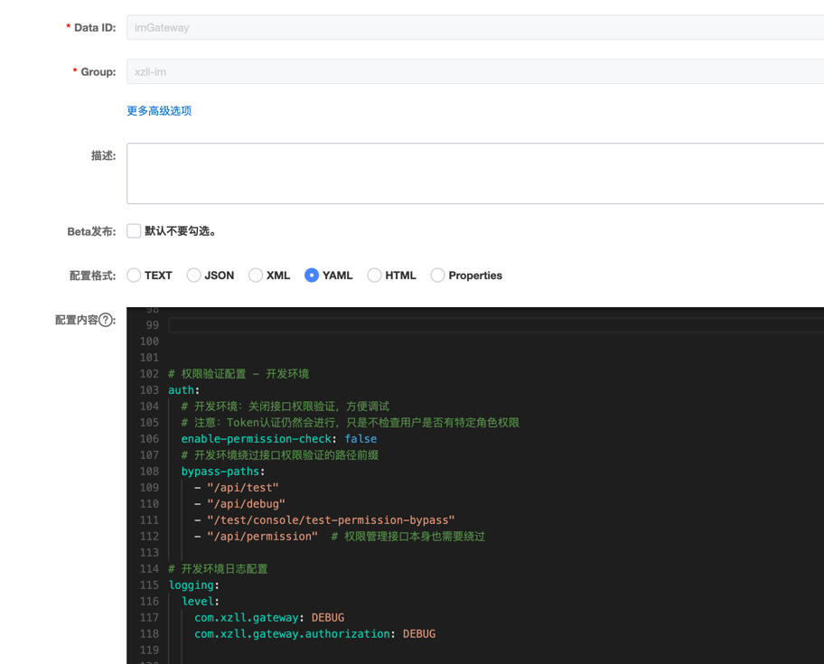

# 接口权限验证开关使用说明

## 功能概述

本功能允许在开发调试时绕过接口权限验证，但保留Token认证。这样可以方便开发人员测试新接口，而无需在页面配置权限。

## 配置说明

### 1. 配置文件

在nacos配置中心配：


### 2. 配置参数

```yaml
auth:
  # 是否启用接口权限验证开关
  # true: 启用接口权限验证（生产环境）- 需要检查用户角色权限
  # false: 绕过接口权限验证（开发调试环境）- 只验证Token，不检查角色权限
  enable-permission-check: true
  
  # 绕过接口权限验证的路径前缀（可选）
  # 当enable-permission-check为false时，这些路径也会被绕过
  # 注意：Token认证仍然会进行，只是不检查用户是否有特定角色权限
  bypass-paths:
    - "/api/test"
    - "/api/debug"
    - "/test/console/test-permission-bypass"
```

## 使用场景

### 开发环境（绕过接口权限验证）

**配置：**
```yaml
auth:
  enable-permission-check: false
```

**效果：**
- ✅ Token认证仍然进行（确保用户已登录）
- ❌ 不检查用户是否有特定角色权限（如admin角色）
- ✅ 新接口可以直接访问，无需在页面配置权限

### 生产环境（启用接口权限验证）

**配置：**
```yaml
auth:
  enable-permission-check: true
```

**效果：**
- ✅ Token认证进行
- ✅ 检查用户是否有访问接口所需的角色权限
- ✅ 确保接口安全性

## 测试接口

### 权限绕过测试接口

**接口地址：** `GET /test/console/test-permission-bypass`

**测试步骤：**
1. 确保已登录（有有效Token）
2. 设置 `auth.enable-permission-check: false`
3. 访问测试接口
4. 应该返回成功响应，无需admin角色权限

### 权限验证测试接口

**接口地址：** `GET /api/permission/required?path=/test/console/get`

**测试步骤：**
1. 设置 `auth.enable-permission-check: true`
2. 访问需要admin权限的接口
3. 应该根据用户角色权限决定是否允许访问

## 注意事项

1. **Token认证始终进行**：无论是否绕过接口权限验证，Token认证都会进行
2. **安全性考虑**：生产环境必须启用接口权限验证
3. **路径配置**：可以通过 `bypass-paths` 配置特定路径绕过权限验证
4. **日志记录**：权限验证过程会记录详细日志，便于调试

## 日志示例

### 绕过权限验证时的日志
```
INFO  - 绕过接口权限验证，但保留Token认证 - 路径: /test/console/test-permission-bypass
DEBUG - Token认证通过，绕过接口权限检查 - 用户: testuser, 路径: /test/console/test-permission-bypass
```

### 正常权限验证时的日志
```
INFO  - 接口所需权限: [ROLE_ADMIN] - 路径: /api/admin/users
DEBUG - 用户权限: [ROLE_USER] - 用户: testuser, 路径: /api/admin/users
WARN  - 权限不足 - 用户: testuser, 用户权限: [ROLE_USER], 所需权限: [ROLE_ADMIN], 路径: /api/admin/users
```

## 切换环境

### 开发环境
```bash
# 使用开发环境配置
java -jar im-gateway.jar --spring.profiles.active=dev
```

### 生产环境
```bash
# 使用生产环境配置
java -jar im-gateway.jar --spring.profiles.active=prod
``` 