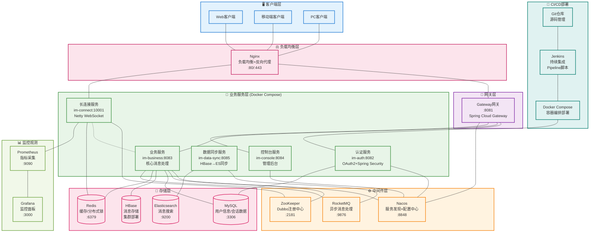
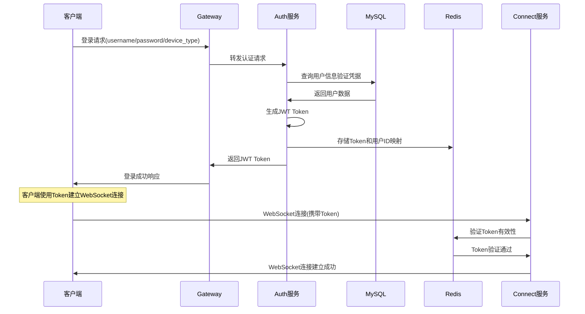
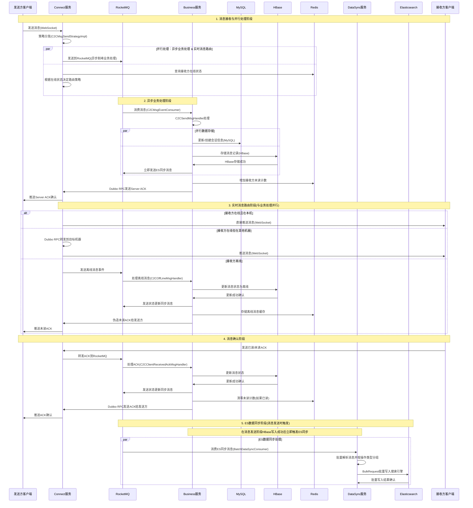
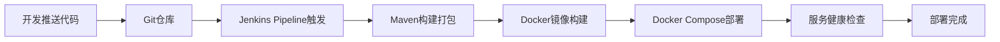

# XZLL-IM 系统架构图

## 🎯 项目概述

XZLL-IM 是一个基于微服务架构的分布式即时通讯系统，采用 Spring Cloud + Dubbo + Netty 技术栈，支持高并发、高可用的实时消息通信。

---

## 🏗️ 系统架构图

---

## 📋 核心模块详解

### 🌐 负载均衡与网关层
| 服务 | 端口 | 职责 | 技术栈 |
|------|------|------|--------|
| **Nginx** | 80/443 | 负载均衡，反向代理，SSL终止 | Nginx |
| **im-gateway** | 8081 | 统一API网关，路由转发，服务发现 | Spring Cloud Gateway |

### 🔐 业务服务层
| 服务 | 端口 | 职责 | 技术栈 |
|------|------|------|--------|
| **im-auth** | 8082 | 用户认证、授权、JWT令牌管理 | OAuth2 + Spring Security |
| **im-connect** | 10001 | WebSocket长连接管理，实时消息推送 | Netty + WebSocket |
| **im-business** | 8083 | 核心业务逻辑，消息处理，数据持久化 | Spring Boot + Dubbo |
| **im-console** | 8084 | 管理后台，消息查询，系统监控 | Spring Boot |
| **im-data-sync** | 8085 | 数据同步，HBase到ES的异步同步 | Spring Boot + RocketMQ |

### 🗃️ 存储架构

#### 主存储系统
- **MySQL**: 用户信息、会话数据、好友关系等结构化数据
- **HBase**: 海量消息记录存储，支持高并发写入
- **Redis**: 缓存用户状态、在线信息、分布式锁

#### 搜索引擎
- **Elasticsearch**: 消息全文搜索、复杂查询、数据分析

---

## 🔄 核心业务流程

### 📱 用户登录流程

### 💬 单聊消息发送流程

---

## 🛠️ 技术栈详情

### 核心框架
- **Spring Boot**: 2.7.0
- **Spring Cloud**: 2021.0.3  
- **Dubbo**: 3.0.7
- **Netty**: 4.1.75.Final

### 中间件
- **Nacos**: 服务发现 + 配置中心
- **ZooKeeper**: Dubbo注册中心
- **RocketMQ**: 4.5.0 异步消息处理
- **Redis**: 缓存 + 分布式锁
- **Redisson**: 分布式锁实现

### 数据存储
- **MySQL**: 8.0.23 关系型数据
- **HBase**: 2.5.7-hadoop3 消息存储
- **Elasticsearch**: 全文搜索
- **MyBatis Plus**: ORM框架

### 监控运维
- **Prometheus**: 指标采集
- **Grafana**: 监控面板
- **Docker**: 容器化部署
- **Jenkins**: CI/CD

---

## 📊 数据库设计

### 核心数据表
| 表名 | 用途 | 存储引擎 |
|------|------|----------|
| `im_user` | 用户基本信息 | MySQL |
| `im_chat` | 会话信息 | MySQL |
| `im_chat_user_opt` | 用户会话操作记录 | MySQL |
| `im_friend_relation` | 好友关系 | MySQL |
| `c2c_msg_record` | 单聊消息记录 | HBase |

### 消息存储策略
- **HBase**: 主存储，RowKey设计支持高效查询
- **Elasticsearch**: 辅助存储，支持全文搜索和复杂查询
- **Redis**: 缓存热点数据，提升查询性能

---

## 🚀 系统特性

### 高可用性
- 微服务架构，服务独立部署
- Nacos服务发现，自动故障转移
- Redis集群，数据高可用

### 高性能
- Netty NIO高性能网络框架
- HBase分布式存储，支持海量数据
- Redis缓存，毫秒级响应
- 异步消息处理，削峰填谷

### 可扩展性
- 水平扩展，按需增加服务实例
- 数据分库分表支持
- 插件化消息处理器

### 可观测性
- Prometheus指标监控
- Grafana可视化面板
- 分布式链路追踪（规划中）

---

## 🚀 部署架构

### 📦 CI/CD 流程

### 🐳 Docker Compose 服务编排
- **统一部署**: 所有微服务通过docker-compose.yml统一编排
- **网络隔离**: 服务间通过Docker网络通信
- **数据持久化**: 关键数据目录挂载到宿主机
- **日志集中**: 统一日志目录便于运维管理

### 🌐 Nginx 配置策略
- **负载均衡**: 多实例服务的负载分发
- **反向代理**: 隐藏内部服务端口，统一对外暴露
- **SSL终止**: HTTPS证书管理和SSL卸载
- **静态资源**: 前端静态文件服务

---

## 🔮 发展规划

### 已实现功能 ✅
- 用户认证与授权
- 单聊消息发送与接收
- 消息存储与搜索
- 服务监控与告警
- Docker容器化部署
- Jenkins CI/CD流水线
- Nginx负载均衡

### 开发中功能 🚧
- 群聊功能
- 离线消息推送
- 消息加密传输
- 移动端适配

### 规划功能 📋
- Kubernetes部署
- 音视频通话
- 文件传输
- 消息撤回与编辑
- 表情包支持
- 机器人集成

---

## 📊 如何查看Mermaid图形

### 在IDEA中查看
1. **安装插件**: 
   - 打开 IDEA → File → Settings → Plugins
   - 搜索并安装 "Mermaid" 插件
   - 重启IDEA

2. **查看图形**:
   - 打开 `.md` 文件
   - 右键选择 "Open in Browser" 或 "Preview"
   - 或者使用IDEA的Markdown预览面板

### 在线查看方式
1. **Mermaid Live Editor**: https://mermaid.live/
   - 复制mermaid代码直接粘贴查看
   
2. **GitHub/GitLab**: 
   - 直接在仓库中查看markdown文件
   - 自动渲染mermaid图形

3. **VSCode**: 
   - 安装 "Mermaid Preview" 插件
   - 实时预览图形效果

### 其他工具
- **Typora**: 支持原生mermaid渲染
- **Notion**: 支持mermaid图形
- **Obsidian**: 通过插件支持

---

## 📞 联系方式

**作者**: 蝎子莱莱爱打怪  
**邮箱**: h163361631@163.com  
**项目地址**: [GitHub链接]

> 💡 这是一个开源项目，欢迎贡献代码和提出改进建议！
